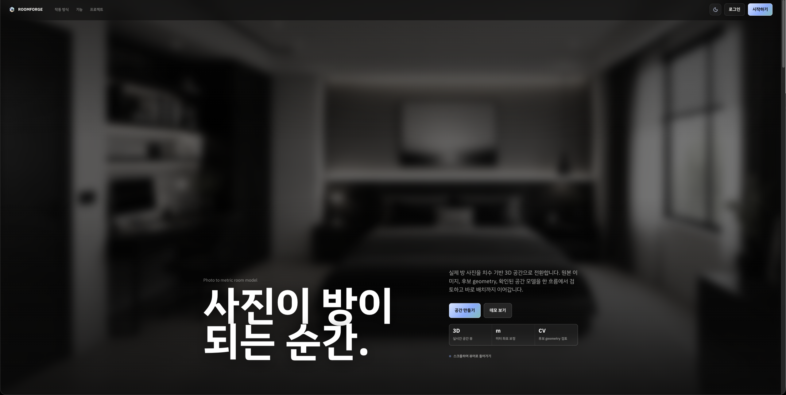
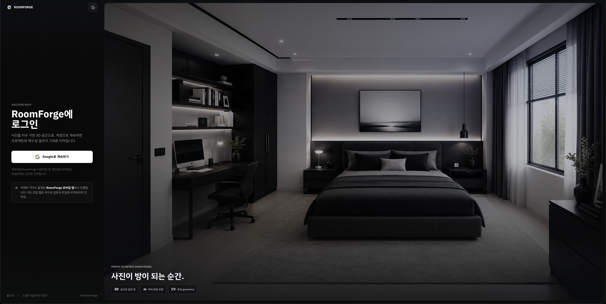
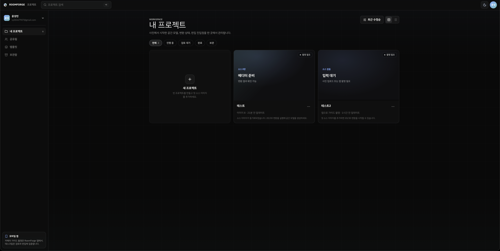
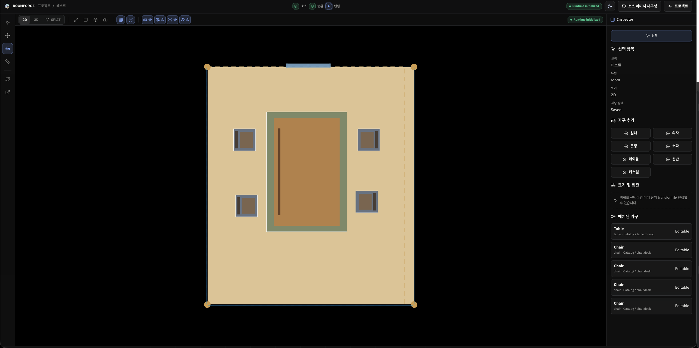
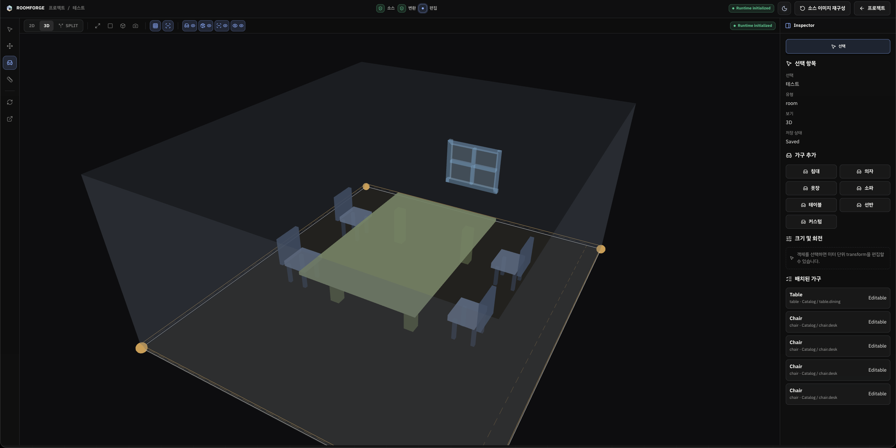

# RoomForge

[English](README.md) | Korean

RoomForge는 웹 우선의 방 재구성 및 가구 배치 계획 애플리케이션입니다.
방 사진과 사용자가 입력한 실제 치수를 기반으로 OpenCV 보조 공간 인식을
수행하고, 사용자가 보정할 수 있는 미터 단위 평면도와 2D/3D 편집
워크스페이스를 만드는 것이 목표입니다.

이 README는 공개 루트 README로 승격하기 전에 먼저 `private/`에서 검토하기
위한 초안입니다.

## RoomForge가 해결하는 문제

RoomForge의 핵심 질문은 간단합니다.

> 이 가구 배치가 실제 내 방에서 가능한가?

제품 흐름은 다음과 같습니다.

1. Google 계정으로 로그인합니다.
2. 방 프로젝트를 만들거나 엽니다.
3. 방 사진을 업로드하거나 촬영합니다.
4. 실제 방 치수를 입력합니다.
5. OpenCV 보조 감지로 방 구조 후보를 생성합니다.
6. 사용자가 감지된 구조를 직접 보정합니다.
7. 보정 결과를 미터 단위 좌표계로 캘리브레이션합니다.
8. 2D/3D 편집기에서 평면도와 방 장면을 확인합니다.
9. 프록시 가구를 추가, 이동, 회전, 크기 조정, 삭제합니다.
10. 완성된 레이아웃을 저장하거나 내보냅니다.

중요한 제품 원칙은 자동화보다 제어권입니다. 컴퓨터 비전 결과는 확정값이
아니라 후보값으로 취급합니다. 사용자가 구조와 가구 배치를 직접 보정할 수
있기 때문에 사진 품질이 완벽하지 않아도 작업을 이어갈 수 있습니다.

## 만든 이유

RoomForge는 이사하거나 방 구조를 바꿀 때, 가구를 실제로 여러 번 옮기기 전에
크기와 배치를 먼저 시뮬레이션해 보기 위해 만들었습니다. 침대, 책상, 옷장,
소파 같은 가구를 직접 옮겨가며 맞춰 보기보다, 먼저 디지털 공간에서 배치를
확인하고 그 결과를 바탕으로 실제 방을 구성하는 흐름을 목표로 합니다.

특히 자취방, 기숙사, 원룸, 작은 침실처럼 공간이 제한된 환경에서는 배치
실수가 생활 동선, 수납 접근성, 책상 공간, 수면 공간에 바로 영향을 줍니다.
이런 이유로 실제 가구를 옮기기 전에 방 배치를 시뮬레이션해 보고 싶은 수요가
있을 것으로 생각합니다.

## 현재 아키텍처

RoomForge는 여러 실행 표면을 가진 워크스페이스입니다.

```text
app/       Flutter 앱 셸, 모바일/촬영 경로, 레거시 웹 지원
web/       React + Vite 데스크톱 웹 워크스페이스, 랜딩, 편집기 호스트, 관리자 UI
editor/    TypeScript + Vite + Three.js/OpenCV.js 공간 편집기
server/    legacy/reference 영역으로 이동 예정인 기존 FastAPI 파일
packages/  공통 스키마, 토큰, 패키지 간 유틸리티
docs/      제품, 리팩터링, 디자인, 검증 문서
private/   배포 대상이 아닌 비공개 문서 초안 작업공간
```

현재 기본 백엔드 방향은 Firebase입니다.

- Firebase Auth: 사용자 인증
- Cloud Firestore: 프로젝트, 구조, 재구성, 레이아웃, 관리자 데이터
- Cloud Storage: 원본 이미지와 생성 아티팩트
- Firebase Security Rules: 소유자/관리자 접근 제어
- 로컬 draft/cache: UI 복구가 필요한 상태 저장

기존 FastAPI/Oracle 경로는 레퍼런스와 명시적 `legacy_api` 작업을 위해서만
남겨 둡니다. 현재 `server/` 트리는 RoomForge의 활성 백엔드가 아니라,
추후 legacy/reference 위치로 옮길 기존 FastAPI 코드로 취급합니다.

## 경계 규칙

주요 구현 경계는 다음과 같습니다.

- 앱/웹 표면은 인증, 라우팅, 권한, 저장, 복구 상태, 사용자 흐름을 담당합니다.
- 편집기는 Three.js 렌더링, OpenCV 오버레이, 구조 핸들, 가구 조작, 카메라
  제어, 공간 검증을 담당합니다.
- 편집기는 Firebase SDK를 import하거나 Firestore/Storage를 직접 읽고 쓰지
  않습니다.
- 후보 구조와 사용자 확정 구조는 상태, 저장소, 내보내기에서 분리합니다.
- Firebase에 저장되는 필드와 export JSON은 `snake_case`를 사용합니다.
- 편집기 브리지 payload는 `camelCase`를 사용합니다.
- 저장되는 재구성 상태는 반드시 다음 값만 사용합니다:
  `created`, `uploading`, `processing`, `review_required`, `succeeded`,
  `failed`, `timeout`, `cancelled`, `retrying`
- 사용자 UI에서는 `review_required`를 `Needs review`로 표시합니다.

## private 초안 메모

`private/`는 별도 Git 서브모듈이며 배포 대상이 아닙니다. 이 README는 공개
README를 갱신하기 전에 검토하기 위해 이 위치에서 먼저 작성하는 초안입니다.

비밀값, 로컬 `.env`, 실제 방 사진, 비공개 Firebase credential, 개인 테스트
아티팩트는 공개 루트 저장소로 옮기지 않습니다. `private` 서브모듈 변경을
공유해야 한다면 `private` 서브모듈을 먼저 커밋/푸시한 뒤 루트 저장소에서
서브모듈 포인터를 갱신합니다.

## 빠른 시작

특별히 다르게 적혀 있지 않으면 RoomForge 루트에서 명령을 실행합니다.

```bash
cd /Users/yoon/Documents/github/RoomForge
```

필요한 패키지 의존성을 설치합니다.

```bash
npm install
(cd web && npm install)
(cd editor && npm install)
(cd app && flutter pub get)
```

기본 Firebase 경로에서는 레거시 서버 준비가 필수는 아닙니다. 보관된 서버
경로나 명시적 `legacy_api` 동작을 검증할 때만 준비합니다.

```bash
cd server
python3 -m venv .venv
.venv/bin/python -m pip install -e '.[dev]'
cd ..
```

## 검증

공개 프로젝트 표면은 패키지 단위 검증 명령을 사용합니다.

```bash
(cd web && npm run build)
(cd editor && npm run typecheck)
(cd app && flutter analyze)
```

Firestore, Storage, Hosting, emulator 설정을 바꾼 경우에는 `app/`에서
Firebase CLI 검증을 실행합니다.

```bash
cd app
firebase emulators:start --only auth,firestore,storage,hosting
```

## 데모 스크린샷

README 데모 스크린샷은 저장소 루트의 `images/` 디렉터리에 둡니다. 현재 데모
이미지는 주요 웹 흐름과 편집기의 2D/3D 워크스페이스를 보여 줍니다.

| 랜딩 | 로그인 |
| --- | --- |
|  |  |

| 프로젝트 | 재구성 검토 |
| --- | --- |
|  |  |

| 2D 편집기 | 3D 편집기 |
| --- | --- |
|  |  |

## 배포 계획

RoomForge 웹 배포 대상은 Firebase Hosting입니다. 아직 이 초안에는 실제
프로덕션 사이트 이름을 고정하지 않습니다. 첫 배포 후 사이트 주소를 여기에
붙여 넣으면 됩니다.

```text
Production site: TBD
```

예정된 웹 배포 흐름은 다음과 같습니다.

```bash
cd /Users/yoon/Documents/github/RoomForge
(cd web && npm run build)
(cd app && firebase deploy)
```

Firebase 설정은 현재 `app/` 아래에 있고, `app/firebase.json`은 React web
빌드 결과물인 `../web/dist`를 Hosting 대상으로 사용합니다.

Android 앱은 Flutter release artifact를 빌드한 뒤 GitHub Release에 함께
첨부해 배포할 예정입니다.

```bash
cd /Users/yoon/Documents/github/RoomForge/app
flutter build apk --release
```

기본 APK 출력 경로:

```text
app/build/app/outputs/flutter-apk/app-release.apk
```

나중에 Play Store 형식의 app bundle이 필요하면 다음 명령을 사용합니다.

```bash
cd /Users/yoon/Documents/github/RoomForge/app
flutter build appbundle --release
```

기본 app bundle 출력 경로:

```text
app/build/app/outputs/bundle/release/app-release.aab
```

GitHub Release의 제목, 태그, 릴리즈 노트, 첨부 artifact는 실제 릴리즈 시점에
정합니다.

## 주요 문서

- 루트 README: [../README.md](../README.md)
- Firebase 리팩터링 인덱스: [../docs/refactor/README.md](../docs/refactor/README.md)
- Firebase 목표 아키텍처:
  [../docs/refactor/firebase-target-architecture.md](../docs/refactor/firebase-target-architecture.md)
- 라우팅 정의:
  [../docs/refactor/routing-page-definition.md](../docs/refactor/routing-page-definition.md)
- 제품 PRD: [../docs/product/prd.md](../docs/product/prd.md)
- 디자인 인덱스: [../docs/design/README.md](../docs/design/README.md)

## 개발 메모

- 제품 변경은 소유 패키지 경계 안에서 작게 유지합니다.
- 변경한 경계를 증명하는 가장 작은 검증 루프를 실행합니다.
- Firebase 또는 보안 작업은 UI 동작만 보지 말고 Firestore/Storage Rules를
  검증합니다.
- CV/editor 작업은 제품 문서만 보지 말고 `editor/`의 실제 런타임 경로를
  확인합니다.
