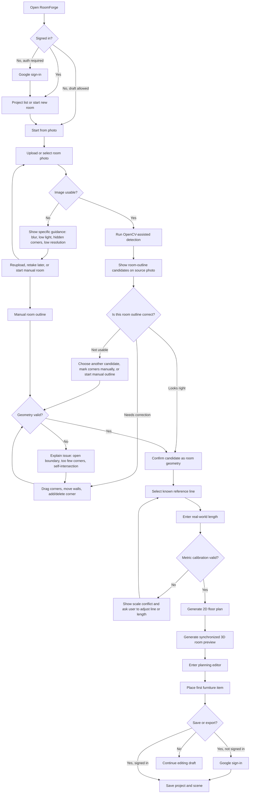
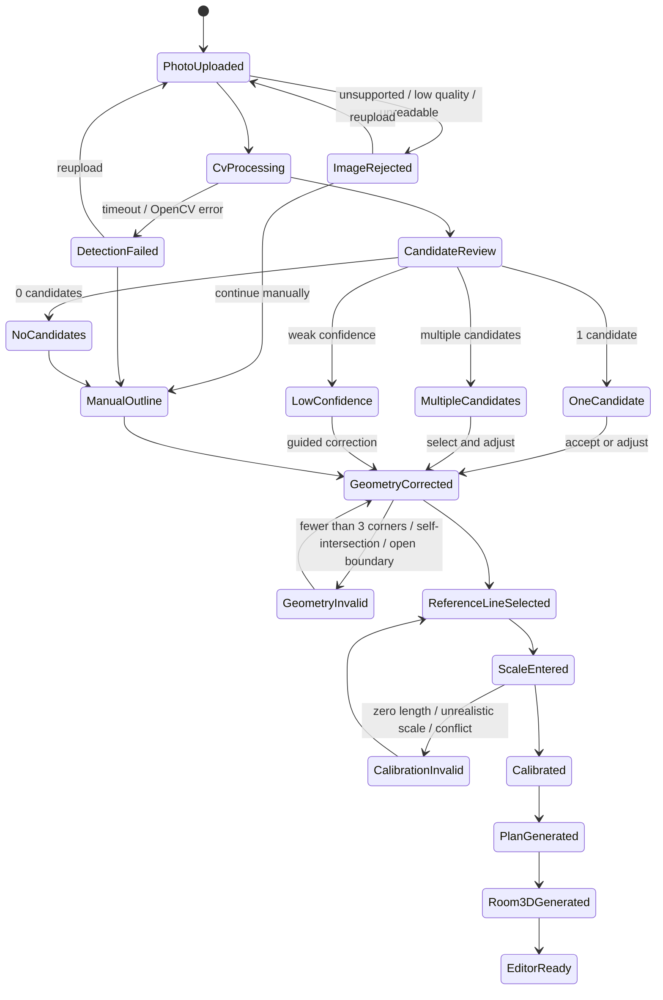
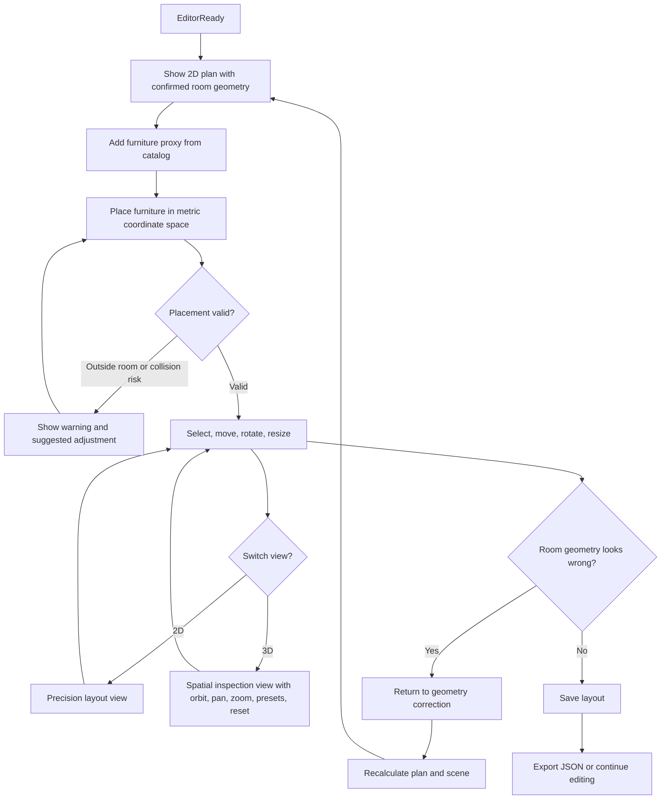
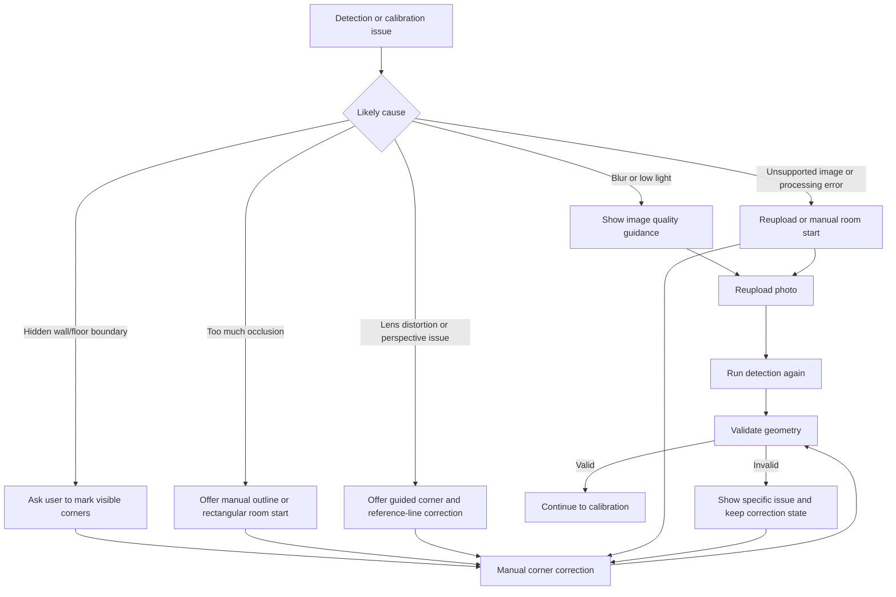
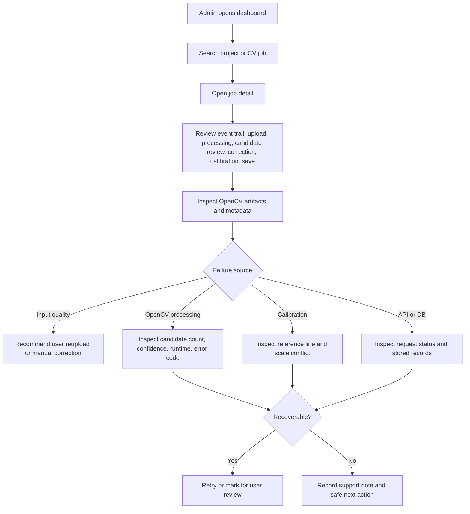

---
stepsCompleted:
  - step-01-init
  - step-02-discovery
  - step-03-core-experience
  - step-04-emotional-response
  - step-05-inspiration
  - step-06-design-system
  - step-07-defining-experience
  - step-08-visual-foundation
  - step-09-design-directions
  - step-10-user-journeys
  - step-11-component-strategy
  - step-12-ux-patterns
  - step-13-responsive-accessibility
  - step-14-complete
inputDocuments:
  - _bmad-output/planning-artifacts/prd.md
  - _bmad-output/planning-artifacts/product-brief-RoomForge.md
  - _bmad-output/planning-artifacts/prd-validation-report.md
workflowType: "ux-design"
lastStep: 14
---

# UX Design Specification RoomForge

**Author:** Yoon
**Date:** 2026-05-07

---

<!-- UX design content will be appended sequentially through collaborative workflow steps -->

## Executive Summary

### Project Vision

RoomForge is a web-first room reconstruction and furniture planning application that turns a real room photo plus user-entered dimensions into an editable, approximately metric 3D room layout. The UX should make constrained reconstruction feel practical and trustworthy: users provide enough real-world context to anchor scale, the system generates an inspectable room draft, and users retain direct control through correction, editing, saving, and exporting.

RoomForge should present itself as a guided planning tool, not a fully automatic photorealistic room scanner. Its core experience is helping users move from an OpenCV-assisted draft into a plan they understand, trust, and can adjust. The product should avoid overstating accuracy; it should explain input requirements, detected visual candidates, processing states, confidence limits, and recovery actions in user-appropriate language.

The primary value moment is not merely seeing a 3D room appear. The strongest MVP "it works" moment is when a user places or adjusts furniture in the generated room and feels the layout is useful enough for real planning decisions.

### Target Users

The primary users are everyday room planners who need a fast starting point for spatial decisions: people preparing to move, checking whether furniture will fit before purchase, planning a small room, or organizing rough room dimensions before a design conversation. They have a room photo and approximate measurements, but they do not want to draw a floor plan manually from scratch.

The core user job is: "I want to enter a room photo and approximate dimensions so I can quickly get an editable draft model and start planning furniture or space use."

Secondary users include technical/demo evaluators and computer vision learners who want to inspect the constrained reconstruction workflow through source images, OpenCV edge/line/corner overlays, corrected boundary points, metric floor plans, and final 3D layouts.

Admin and support users are also MVP-critical, but they should remain distinct from the primary room-planning experience. Because reconstruction quality and saved layout trust matter for the MVP, admins need clear job/provider monitoring, OpenCV artifact lookup, retry controls, and troubleshooting views. Their job is not simply to control infrastructure; it is to diagnose why a user's work is delayed or failed and decide the safest next action.

### Key Design Challenges

The first design challenge is trust calibration across the whole workflow. Users may expect automatic AI reconstruction to recover the full room perfectly, but RoomForge's MVP produces a constrained rectangular metric layout. Trust must be built through capture guidance, dimension entry, processing status, uncertainty indicators, editable results, and clear save/export states rather than only through a polished final view.

The second design challenge is recovery from poor inputs and uncertain outputs. Bad-photo handling should not feel like blame or a dead end. The UX should identify likely issues such as blur, low light, insufficient visible floor, missing room corners, excessive occlusion, lens distortion, or unrealistic dimensions, then give users a next action: retake, reupload, correct dimensions, continue with caution, or use manual correction where supported.

The third design challenge is workflow continuity across OpenCV/manual-assisted reconstruction attempts. Reconstruction is not a simple loading spinner; it may pass through created, processing, review_required, succeeded, failed, timeout, or cancelled states. Users should be able to leave, refresh, sign back in, and still understand where the job stands and what to do next.

The fourth design challenge is approachable web-based 3D editing. Users need room-planning direct manipulation, not a simplified professional modeling tool. The editor should emphasize selecting room or furniture objects, changing key dimensions, moving, rotating, resizing, deleting, viewing scale cues, switching between useful views, saving safely, and exporting without making users learn complex 3D software concepts.

The fifth design challenge is admin UX. Admin screens must expose enough operational detail for debugging without overwhelming the operator: job status, failure reason, retry history, reconstruction provider state, user/project lookup, OpenCV artifact references, and optional provider cost/runtime signals should be easy to scan. Admin UX should center on diagnosis and safe intervention.

### Design Opportunities

RoomForge can differentiate by combining guided capture/input quality UX with an editable metric result. Instead of asking users to draw a room from zero, the app can use the photo as orientation and context while letting dimensions anchor the final layout.

The product can also differentiate through honest computer vision feedback. Showing source image, OpenCV candidate overlays, corrected boundary points, action-oriented confidence states, failure reasons, and retake guidance can make users trust RoomForge more than black-box interior image generators. Confidence should be framed as user action, such as "ready," "needs review," or "manual input needed," rather than only as abstract numeric scores.

The term-project killer feature should be visible in the UX, not hidden behind a generic "generate" button. Users and evaluators should be able to see OpenCV evidence such as edges, dominant lines, corner candidates, corrected boundary points, and calibration results so the reconstruction feels explainable and inspectable.

The 3D editor is a major opportunity for utility and delight. A clean room canvas with dimension guides, proxy furniture presets, direct manipulation, undo/redo where feasible, 2D/3D view switching, grid or snap aids, reliable save states, and JSON export can make the product useful before advanced reconstruction features exist.

The admin experience can become a quiet strength of the MVP. By making OpenCV reconstruction artifacts, provider state, and failure reasons visible, RoomForge can make processing failures diagnosable and create a feedback loop for improving reconstruction quality over real usage.

## Core User Experience

### Defining Experience

The defining RoomForge experience is turning a room photo and approximate dimensions into an editable planning draft that users can quickly inspect, correct, and use for furniture decisions. The core loop is: create or open a room project, provide a suitable room photo, enter dimensions, submit reconstruction, review the generated draft, correct or confirm the result, place furniture, save, and export.

The most important interaction is not simply generating a 3D room. It is helping the user move from an OpenCV-assisted approximate room draft into a useful, user-controlled plan. If RoomForge gets one interaction right, it should be direct room-and-furniture editing with clear scale feedback: users should be able to select objects, understand dimensions, adjust placement, and save without feeling they are operating a CAD tool.

### Platform Strategy

The MVP is web-first. The primary experience should target desktop and laptop browsers because detailed 3D editing, dimension review, furniture placement, and admin operations benefit from mouse/keyboard precision and screen space.

The client strategy is a Flutter web app shell deployed through Firebase Hosting, with Firebase Google Auth for access and an embedded or integrated web-first Three.js editor for the room/furniture canvas. The UX should treat this as one continuous product experience even if the implementation crosses Flutter and Three.js boundaries.

Tablet-width layouts should support project review and light editing. Narrow mobile web can support sign-in, project review, upload, and status checking, but direct smartphone capture is Phase 2. Future mobile clients should emphasize camera capture guidance, while detailed editing can remain stronger on web.

Offline functionality is not required for MVP. However, users should not lose trust when network or reconstruction-provider work is interrupted: project state, job status, unsaved changes, and save/export failures should be visible and recoverable where feasible.

### Effortless Interactions

Creating a project, signing in with Google, uploading a room photo, entering dimensions, and starting OpenCV-assisted reconstruction should feel straightforward and guided. Users should not have to understand computer vision internals, optional GPU providers, or backend job orchestration to complete the flow.

Photo suitability guidance should reduce failed attempts before upload. The app should make suitable capture conditions obvious: level photo, visible floor, visible wall/floor boundaries, enough room context, and realistic dimensions.

The reconstruction flow should feel continuous. Users should be able to see whether a job is created, processing, needs review, succeeded, failed, timed out, or recoverable without needing infrastructure language. The system should preserve job continuity across refresh, sign-out/sign-in, and later return to the project.

The editor should make common planning actions effortless: add a furniture proxy, select it, move it, rotate it, resize it, delete it, compare scale, switch between useful views, save changes, and export. Dimension and confidence cues should guide users toward what needs review.

Admin workflows should make diagnosis effortless: find a job, see its state history, identify likely failure source, inspect OpenCV/provider artifacts, retry a recoverable job, and decide whether the user needs guidance or the system needs intervention.

### Critical Success Moments

The first critical success moment is expectation alignment before upload. Users should understand that RoomForge creates an approximate, editable planning draft anchored by their dimensions, not a perfect automated room scan.

The second critical success moment is reconstruction continuity. Users should feel that their job is safely tracked even when OpenCV/manual-assisted processing needs review, takes time, or fails.

The third critical success moment is result review. Users should see the generated room, understand its confidence level, and know whether it is ready, needs review, or requires manual input.

The fourth and most important success moment is useful editing. A user should be able to place or adjust at least one furniture object and feel that the generated room is now useful for a real layout decision.

The fifth critical success moment is persistence. Users should trust that saved layouts, exported JSON, job metadata, and project records will survive refreshes and later sessions.

For admins, the critical success moment is diagnosing a failed or delayed job and safely choosing the next action: retry, inspect OpenCV artifacts, inspect records, or guide the user to provide better input.

### Experience Principles

1. Guided planning over magical scanning: RoomForge should consistently frame AI output as an editable draft, not unquestionable truth.

2. Trust through visible state: progress, uncertainty, failure reasons, saved state, and next actions should be clear at every major step.

3. Correction is part of the product: photo issues, reconstruction uncertainty, and dimension edits should be treated as normal recoverable paths, not exceptional errors.

4. Direct manipulation over technical modeling: the 3D editor should support room planning actions in plain terms, with scale and selection feedback always close at hand.

5. Web-first precision, mobile-ready capture path: detailed planning is optimized for desktop web now, while future smartphone support should focus on guided capture and project continuity.

6. Admin UX is operational confidence: admin screens should expose enough state to reduce cost anxiety, diagnose failures, and keep the MVP usable without making everyday users think about infrastructure.

## Desired Emotional Response

### Primary Emotional Goals

RoomForge should make users feel oriented, capable, and in control. The desired emotional response is not pure surprise at AI output; it is practical confidence that the user can turn a real room photo into a useful planning draft and make layout decisions from it.

The product should create a feeling of grounded assistance: the system helps users avoid starting from a blank floor plan, but the user remains the person who confirms dimensions, reviews uncertainty, edits the room, and decides what layout works.

For admin and support users, RoomForge should create operational calm. The admin experience should make failures and delays feel diagnosable and recoverable rather than mysterious or costly.

### Emotional Journey Mapping

When users first discover or enter RoomForge, they should feel that the product is approachable and honest. They should understand that the app creates an approximate editable room draft, not a perfect scan, and that they do not need computer vision or 3D modeling expertise to begin.

During photo upload and dimension entry, users should feel guided rather than tested. Capture guidance, input validation, and examples should reduce anxiety about whether their photo is "good enough."

During reconstruction processing, users should feel that the system is still working and their project is safe. Job status should replace vague waiting with continuity: created, processing, needs review, ready, failed, or recoverable failure.

When the generated room appears, users should feel curious but not over-trusting. The result should invite review: what looks reliable, what needs checking, and what can be corrected.

During 3D editing, users should feel agency. Selecting, moving, resizing, rotating, saving, and exporting should reinforce that the room is now theirs to shape.

After saving or exporting, users should feel accomplishment and relief: they have a usable spatial plan, not just an image or a temporary experiment.

When something goes wrong, users should feel redirected rather than blamed. The product should explain likely causes, preserve work when possible, and provide a next action.

When users return, they should feel continuity. Projects, saved layouts, job history, and previous results should make RoomForge feel dependable over multiple sessions.

### Micro-Emotions

The most important micro-emotions are confidence over confusion, trust over skepticism, agency over helplessness, and calm over anxiety.

Users should feel confidence when entering dimensions, seeing scale guides, reviewing confidence states, and saving layouts. They should feel agency when correcting AI output, adjusting furniture, and choosing whether to proceed with a low-confidence result.

The product should avoid false certainty. A polished but incorrect 3D result can create later frustration, so uncertainty should be visible in action-oriented language such as "Ready," "Needs review," or "Manual input needed."

For admin users, the key micro-emotions are clarity and safety. Admin actions such as retrying jobs, inspecting OpenCV artifacts, or inspecting failed results should feel deliberate, auditable, and reversible where possible.

### Design Implications

To create confidence, RoomForge should show scale cues, dimension labels, editable fields, clear save states, and visible differences between system-estimated values and user-confirmed values.

To create trust, the app should show capture guidance before upload, explain reconstruction status during processing, expose failure reasons when available, and avoid presenting AI output as unquestionable truth.

To create agency, the editor should prioritize direct manipulation and plain-language controls: select, move, rotate, resize, delete, undo where feasible, switch view, save, and export.

To create calm during waiting, the job flow should show persistent status, explain processing and needs-review states in user-friendly language, and preserve project continuity across refresh or return visits.

To create safe recovery, failed or low-confidence states should always include a next action such as retake, reupload, correct dimensions, retry, continue with caution, or contact/admin review.

To create operational calm for admins, admin screens should emphasize scanability, failure source, retry history, OpenCV/provider artifacts, provider state, and safe intervention controls.

### Emotional Design Principles

1. Confidence beats spectacle: prioritize user confidence in planning decisions over dramatic AI presentation.

2. Honesty builds trust: clearly communicate approximation, uncertainty, and failure without making the user feel at fault.

3. Every waiting state needs continuity: users should always know that their project is tracked and what is happening next.

4. Every failure needs a next action: recovery paths should be visible, specific, and calm.

5. Editing should feel empowering, not technical: the room editor should behave like a planning workspace, not a 3D modeling suite.

6. Admins need calm diagnosis: operational UX should turn reconstruction job/provider complexity into clear state, cause, and safe action.

## UX Pattern Analysis & Inspiration

### Inspiring Products Analysis

Floorplanner is the strongest functional inspiration for RoomForge's room editing experience. Its relevant pattern is not only 3D viewing, but the ability to move between a practical 2D planning view and an inspectable 3D view. RoomForge should learn from this model by treating 2D and 3D as complementary working modes: 2D for precision, layout, dimensions, and furniture placement; 3D for spatial understanding, camera inspection, height perception, and user confidence.

The key lesson from Floorplanner is the rhythm of moving from exact plan thinking to spatial confidence. RoomForge should not copy professional planning complexity wholesale. Instead, it should adapt the core pattern into a synchronized correction workspace where the same room can be inspected and edited through different views.

A Floorplanner-like experience also suggests that camera control matters. Users should be able to freely adjust viewpoint in 3D, while still having stable reset, fit-to-room, and preset views so they do not get lost. The product should support a sense of spatial ownership: users can inspect the room from different angles, return to a reliable planning view, and understand how furniture placement translates between 2D and 3D.

Toss is a strong motion and mobile interaction inspiration. The relevant lesson is that animation should make state changes feel smooth, clear, and trustworthy without slowing the user down. RoomForge should use motion to explain transitions between screens, upload states, job states, editor panels, object selection, save confirmation, 2D/3D mode switching, and mobile navigation.

The broader inspiration target is a highly polished, fluid interaction layer. RoomForge should feel responsive and modern even when underlying reconstruction takes time. Smooth animation can help the product feel alive during transitions, but it should never hide uncertainty, delay, or failure.

### Transferable UX Patterns

2D/3D mode switching should become a core RoomForge pattern. The editor should provide a clear way to switch between a 2D plan view and a 3D room view. This should feel like seeing the same room through different lenses, not like jumping between disconnected tools.

2D and 3D views should be synchronized projections of a single spatial data model. Object identity, scale, selection state, edit context, room dimensions, and furniture placement should persist across view switches. If a user selects a wall, floor area, or furniture object in one view, the corresponding element should remain visible or highlighted in the other view where feasible.

2D view should prioritize precision. It should support room dimensions, furniture footprints, snapping/grid cues, alignment, and object positioning. This mode is best for deciding whether furniture fits and whether the generated draft matches known measurements.

3D view should prioritize confidence. It should help users understand scale, height, wall/floor relationships, furniture volume, and the lived feel of the arrangement. This mode is best for inspecting whether the layout makes sense spatially.

Free 3D viewpoint control should support exploration without disorientation. Users should be able to orbit, pan, zoom, and reset the camera. Preset views such as Top, Front, Corner, Eye-level, and Reset should give users safe anchors when free camera control becomes confusing. Reset should remain easy to access.

Motion should communicate continuity. Transitions between project list, upload, reconstruction status, result review, editor, save, and export should feel connected rather than abrupt. Mobile interactions should use smooth navigation, panel motion, and confirmation feedback inspired by Toss-like polish.

Animation should support state comprehension. Object selection, furniture placement, snap feedback, dimension edits, mode switching, panel opening, save completion, job progress, and error recovery can all benefit from subtle motion that clarifies what changed. Motion should be functional: direction, feedback, and trust before decoration.

Async or provider-backed reconstruction should remain observable. Created, processing, needs-review, retrying, failure, and completion states should be visible in user-appropriate language. Polished transitions must not hide long-running processing, uncertainty, or failure.

### Anti-Patterns to Avoid

Avoid camera disorientation. Free 3D control without reset, preset views, fit-to-room behavior, or spatial anchors can make users feel lost and reduce trust in the editor.

Avoid treating 3D as the only serious editing mode. Many layout decisions are easier in 2D, so forcing all planning through 3D would create unnecessary friction.

Avoid disconnected 2D and 3D state. If an object is selected, moved, resized, saved, or deleted in one mode, the other mode must reflect that state clearly. Losing selection or subtly changing coordinates across view switches should be treated as a UX failure.

Avoid decorative animation that slows down task completion. Motion should support clarity and responsiveness, not become visual noise.

Avoid hiding system delays behind overly polished transitions. Reconstruction processing, provider delay, and failure states should remain explicit even when the surrounding UI feels smooth.

Avoid mobile overreach in the MVP. Mobile can use polished navigation, review flows, status checking, and lightweight correction, but detailed 2D precision editing and complex 3D manipulation should remain web/desktop-first until direct smartphone capture and mobile editing constraints are designed separately.

Avoid fully free flight camera as the default. MVP camera freedom should be constrained enough to protect orientation, performance, and task focus.

Avoid ignoring reduced-motion needs. Smooth animation should respect `prefers-reduced-motion` and should not make essential state comprehension depend only on movement.

### Design Inspiration Strategy

RoomForge should adopt Floorplanner's 2D/3D workspace concept as a core editor strategy. The MVP should treat 2D and 3D as two synchronized views of the same room layout, not separate experiences.

RoomForge should adapt free camera control with guardrails. Users should have enough freedom to inspect the room, but always have safe view presets, camera reset, fit-to-room behavior, and visible orientation cues.

RoomForge should adopt Toss-like motion principles for mobile and general UI transitions: fast, smooth, stateful, and confidence-building. Motion should make the interface feel responsive while preserving task clarity.

RoomForge should adapt animation for editor feedback: selected objects, drag movement, snap feedback, dimension edits, save state, view switching, and panel transitions should feel polished and immediate.

RoomForge should use a web-first precision editor and a mobile-assisted review/capture path. The MVP should focus detailed planning on desktop web while keeping mobile interactions smooth, lightweight, and future-ready for smartphone capture.

RoomForge should avoid copying highly complex professional planning tools too early. The MVP should stay focused on the core planning loop: review generated draft, correct dimensions, place furniture, inspect in 2D/3D, save, and export.

### Pattern Acceptance Criteria

- 2D/3D views must preserve selection, scale, edit context, and object identity across switches.
- 2D and 3D must derive from one shared spatial data model rather than independent unsynchronized states.
- 3D camera freedom must always be paired with reset, fit-to-room behavior, and preset anchors such as Top, Front, Corner, Eye-level, and Reset.
- Camera and mode transition animation should be short, predictable, and oriented around the current selection or room center.
- Motion must clarify state transitions and must not mask processing latency, provider delay, reconstruction failure, or save/export failure.
- Motion should support reduced-motion preferences.
- Every async or provider-backed reconstruction operation must expose visible state, failure handling, and recovery path.
- Mobile MVP must prioritize review, status checking, upload, and lightweight correction rather than full precision authoring.

## Design System Foundation

### 1.1 Design System Choice

RoomForge should use a themeable established foundation rather than a fully custom design system. The recommended foundation is Flutter Material 3 for the app shell, forms, navigation, dialogs, admin screens, authentication flows, and responsive layout primitives, customized with RoomForge-specific design tokens and interaction patterns.

The 2D/3D editor should use a custom tool-surface layer on top of this foundation. Editor controls, canvas overlays, object selection states, camera presets, dimension labels, grid/snap controls, OpenCV candidate overlays, confidence indicators, and view-switching controls should be designed specifically for RoomForge because generic app components are not enough for a spatial planning workspace.

The design system direction is therefore:

- Material 3 as the baseline app UI system.
- Custom RoomForge theme tokens for color, spacing, typography, elevation, motion, and status semantics.
- Custom editor controls for 2D/3D planning interactions.
- Custom OpenCV review controls for edge/line/corner overlays, corrected boundary points, and calibration states.
- Motion principles inspired by Toss: smooth, functional, fast, and state-explanatory.
- Admin screens using dense, utilitarian Material-style components with strong status hierarchy.

### Rationale for Selection

RoomForge needs fast development and reliability more than complete visual uniqueness at the MVP stage. Material 3 provides proven patterns for authentication, forms, navigation, lists, dialogs, buttons, tables, accessibility, responsive layout, and Flutter implementation consistency.

The project also needs visual and interaction differentiation in the editor. The core RoomForge experience is not a standard CRUD app; it is a synchronized spatial workspace with an explainable OpenCV-assisted reconstruction flow. This requires custom components for 2D/3D switching, camera controls, selected object panels, dimension editing, OpenCV overlays, confidence state overlays, job progress, and save/export states.

A hybrid approach gives RoomForge the right balance: use established components where users expect ordinary app behavior, and invest custom design effort where the product's value is created.

This choice also fits the technical direction. The client is expected to use Flutter web for the product shell and a web-first Three.js editor for the room/furniture canvas. Material 3 can govern the Flutter shell, while the editor layer can maintain its own canvas-specific interaction vocabulary without visually feeling disconnected.

### Implementation Approach

The app shell should use Flutter Material 3 components for:

- Google sign-in and account flows.
- Project list and project detail navigation.
- Upload and dimension-entry forms.
- OpenCV review and reconstruction status screens.
- Save/export dialogs and confirmation states.
- Admin tables, filters, details, retry actions, and status badges.
- Responsive navigation for desktop, tablet-width, and narrow mobile review flows.

The editor layer should define custom RoomForge components for:

- 2D/3D mode switch.
- Camera preset controls: Top, Front, Corner, Eye-level, Reset, and fit-to-room.
- Object selection indicators synchronized across 2D and 3D.
- Furniture tool palette.
- Object inspector panel.
- Dimension labels and editable numeric fields.
- Grid, snap, and scale controls.
- OpenCV edge/line/corner candidate overlays.
- Corrected boundary/corner point handles.
- Calibration and needs-review overlays.
- Unsaved/saving/saved/save-failed state indicators.
- Job/provider state overlays when reconstruction is still processing or recoverable.

The Three.js editor UI should visually align with the Flutter shell through shared tokens where possible: color roles, spacing rhythm, border radius, typography scale, status colors, and motion timing. The implementation should avoid creating two separate-looking products inside one app.

### Customization Strategy

RoomForge should define a restrained, work-focused visual language. The interface should feel precise, calm, spatial, and modern rather than decorative or marketing-heavy.

Core customization areas:

- Color tokens should distinguish neutral workspace surfaces, selected objects, measurement guides, OpenCV candidates, user-confirmed geometry, confidence states, failure states, admin status, and save/job status.
- Typography should prioritize legibility for dimensions, labels, controls, and dense admin data.
- Spacing should support dense but readable tool surfaces, especially on desktop editor and admin screens.
- Motion tokens should define short, predictable transitions for panels, selection, mode switching, save feedback, OpenCV overlay review, and mobile navigation.
- Status tokens should standardize job states, confidence states, save states, reconstruction provider states, and admin severity.
- Editor components should maintain stable dimensions so toolbars, panels, labels, and controls do not shift during interaction.

The design system should avoid excessive custom styling in ordinary app screens. Custom effort should be concentrated on the editor, OpenCV review flow, and operational states where RoomForge's product value and trust are created.

### Motion and Accessibility Foundation

Motion should be part of the design system, not an afterthought. RoomForge should define motion categories for:

- Navigation transitions.
- Panel open/close.
- 2D/3D mode switching.
- Camera preset transitions.
- Object selection and drag feedback.
- Snap or alignment feedback.
- OpenCV candidate confirmation and boundary correction feedback.
- Save/export confirmation.
- Job progress and recovery state changes.

Motion should clarify state transitions and preserve spatial orientation. It should not hide processing latency or make the interface feel slower. Reduced-motion preferences should be respected, and critical state changes should never depend only on animation.

### Component Strategy

Use standard Material 3 components for commodity UI. Create custom components only when the product requires spatial planning behavior, OpenCV review behavior, or stronger state visualization.

Custom component candidates:

- Room workspace shell.
- 2D/3D view switcher.
- Camera control cluster.
- Furniture palette.
- Object inspector panel.
- Dimension editor.
- OpenCV candidate overlay.
- Boundary correction handles.
- Calibration/review overlay.
- Job status timeline.
- Reconstruction provider status panel.
- Admin job table with retry/failure affordances.

## 2. Core User Experience

### 2.1 Defining Experience

RoomForge's defining experience is: "Correct the OpenCV-assisted room geometry and see it become a usable metric 2D/3D planning space."

The user uploads a room photo, enters known dimensions, reviews OpenCV-detected candidate lines/corners/boundaries, corrects the proposed geometry, and then watches the system convert that corrected geometry into a 2D floor plan and simple 3D room. This interaction makes RoomForge different from both image-only interior tools and blank-canvas floor planners.

If RoomForge gets one interaction perfectly right, it should be the transition from visual evidence to editable spatial plan: OpenCV candidates are visible, user correction is easy, metric calibration is understandable, and the resulting room immediately supports furniture planning.

### 2.2 User Mental Model

Users currently solve this problem by measuring rooms, sketching rough plans, using generic floor planners, or guessing from photos. Their mental model is practical rather than technical: "I know roughly what this room looks like and how big it is; help me turn that into something I can plan with."

Users expect the photo to help them avoid starting from a blank canvas. They do not expect to tune computer vision algorithms, but they can understand and correct visible points, corners, walls, and outlines if the interface makes those elements concrete.

The likely confusion points are:

- Thinking the app will automatically reconstruct the room perfectly.
- Not understanding why OpenCV candidates are incomplete or wrong.
- Losing track of which boundary/corner is selected.
- Not knowing whether the result is reliable enough.
- Feeling that correction work is slower than drawing the room manually.
- Losing orientation when moving between photo review, 2D plan, and 3D view.

The UX should therefore frame OpenCV output as a helpful draft, not a verdict. The user should feel that correcting the geometry is part of the product, not a failure state.

### 2.3 Success Criteria

The core experience succeeds when users can upload a valid room photo, understand the OpenCV candidate overlay, correct boundary/corner points, enter or confirm real dimensions, and generate a useful 2D/3D room layout without developer help.

Success indicators:

- Users can identify what the OpenCV overlay is suggesting.
- Users can correct the room boundary or corner points without confusion.
- Users can see how their correction changes the resulting plan.
- Users can understand which dimensions anchor the metric scale.
- Users can switch between photo review, 2D plan, and 3D view without losing context.
- Users can place at least one furniture object and judge whether the layout is useful.
- Users understand when the result is ready, needs review, or failed.
- The flow remains useful even when OpenCV candidates are imperfect.

The experience should feel fast enough that correction feels easier than drawing from scratch. The MVP should prioritize transparent correction and immediate feedback over fully automatic reconstruction.

### 2.4 Novel UX Patterns

RoomForge combines established patterns in a novel way.

Established patterns:

- Photo upload and guided input forms.
- Point/handle editing on an image.
- 2D floor-plan editing.
- 3D orbit/pan/zoom inspection.
- Status and retry flows for processing.
- Admin tables and job detail views.

Novel combination:

- OpenCV visual evidence is shown directly on the room photo.
- The user corrects detected geometry instead of passively accepting an AI result.
- Corrected geometry becomes a metric 2D plan.
- The same spatial model becomes an editable 3D room.
- The user can move between photo evidence, 2D precision, and 3D confidence.

The teaching strategy should use familiar metaphors: "Adjust the room outline," "Drag corners to match the room," "Confirm the known wall length," and "Review in 2D/3D." Avoid algorithmic language in the main user flow, while preserving OpenCV artifacts for evaluation/admin views.

### 2.5 Experience Mechanics

**1. Initiation**

The user starts from a room project and chooses to create a room from a photo. The interface asks for a suitable room image and basic dimensions such as width, depth, and optional height. Capture/upload guidance explains that visible room boundaries and level photos produce better results.

**2. OpenCV Candidate Review**

After upload, the system displays the source image with detected edges, dominant lines, corner candidates, or suggested boundary points. The overlay should be readable and calm: candidates are suggestions, not final geometry.

The user can accept, drag, add, remove, or refine boundary/corner points. Handles should be large enough to manipulate, selected points should be visibly distinct, and the current correction step should be clear.

**3. Metric Calibration**

The user confirms which dimension anchors the result, such as room width or depth. The system maps corrected geometry to the known measurement and shows dimension feedback. If calibration is unstable, the system explains what needs review.

**4. 2D Plan Generation**

The corrected and calibrated geometry becomes a 2D floor plan. Users can inspect dimensions, adjust room shape where supported, and view furniture footprints. This view prioritizes precision.

**5. 3D Room Generation**

The same spatial model is extruded into a simple 3D room. Users can orbit, pan, zoom, and use camera presets such as Top, Front, Corner, Eye-level, Reset, and fit-to-room. This view prioritizes spatial confidence.

**6. Furniture Planning**

Users add proxy furniture, select objects, move, rotate, resize, delete, and inspect the result across 2D and 3D. Selection and object identity should persist across views.

**7. Feedback and Recovery**

The system uses action-oriented states: ready, needs review, manual input needed, failed, saved, save failed, export ready, and export failed. If OpenCV candidates are weak or calibration fails, the user can correct points, reupload, retake, or continue manually where supported.

**8. Completion**

The user knows they are done when the layout is saved/exported and the room/furniture state is preserved. The successful outcome is a metric room plan and 3D arrangement that can be revisited later.

## Visual Design Foundation

### Color System

RoomForge should use a restrained, work-focused color system that supports precision, trust, and visual inspection. The base interface should be calm and neutral so that room geometry, OpenCV overlays, selected objects, measurement guides, and status states remain easy to read.

The visual system should make geometric trust visible. In the photo-based canvas, the hierarchy should be: source image, OpenCV candidates, user-confirmed geometry, editing tools, and supporting information. The interface should help users quickly understand what was detected, what they have accepted or corrected, what is currently selected, and what still needs review.

Recommended color strategy:

- Neutral workspace colors for app surfaces, editor background, panels, admin tables, and form surfaces.
- A clear primary accent for active controls, selected objects, and current workflow steps.
- A distinct OpenCV candidate color for detected edges, lines, corners, or suggested boundaries.
- A separate user-confirmed geometry color so users can distinguish system suggestions from their corrections.
- Semantic status colors for ready, needs review, failed, saved, processing, and provider unavailable states.
- Furniture colors should be subdued enough not to compete with measurement and correction overlays.

Suggested semantic mapping:

- Background: off-white or very light neutral for app screens; slightly darker neutral for editor canvas surroundings.
- Surface: white or near-white panels with subtle borders.
- Primary: clear blue or blue-green for active actions and selected UI states.
- OpenCV Candidate: cyan, amber, or yellow-orange for suggested lines/corners, always paired with a dashed or low-opacity style.
- User Confirmed: green or teal for corrected/accepted geometry, always paired with a solid and stronger style.
- Selected: primary accent with outline, halo, or vertex markers.
- Measurement: muted blue for dimensions and scale guides.
- Warning / Needs Review: amber.
- Error / Failed: red or orange-red with hatch, icon, or label treatment.
- Success / Saved: green.
- Admin / Provider Status: use the same semantic status system to avoid a separate operational color language.

The palette should avoid looking like a decorative interior-design app. RoomForge should feel like a precise planning workspace, not a mood board. At the same time, it should avoid feeling so cold that first-time users feel afraid to experiment. Confirmation, progress, and success states should use calm language and reassuring visual treatment.

### Visual Layers

The editor should organize visual tokens into three layers:

- Detection Layer: OpenCV candidates. These should look temporary, inspectable, and not yet trusted. Use thin strokes, dashed or dotted lines, lower opacity, hollow handles, and confidence labels where useful.
- Geometry Layer: user-confirmed walls, corners, and boundaries. These should look stable, trusted, and editable. Use stronger strokes, solid lines, clear handles, and visible selection/focus states.
- Planning Layer: furniture, layout, circulation or spacing hints, and future collision/fit feedback. These should support decision-making without overpowering confirmed room geometry.

Color is only a supporting cue. OpenCV candidates, confirmed geometry, selected elements, and error states must also differ by stroke weight, dash pattern, halo or outline, handle shape, label treatment, and icon/status treatment.

Every spatial overlay should remain readable on both bright and dark photo backgrounds. Candidate and confirmed geometry should use outline, halo, contrast stroke, or similar treatment so lines do not disappear over walls, shadows, windows, furniture, or wood flooring.

### Visual Token Matrix

The MVP should define a small, testable overlay state set:

| State | Token | Rendering Rule | Handle Rule | Notes |
|---|---|---|---|---|
| OpenCV candidate | `overlayCandidate` | Thin dashed stroke, lower opacity, halo/outline | Hollow circle or cross | Suggested by the system, not yet accepted |
| Selected | `overlaySelected` | Primary accent, stronger outline or glow, highest local contrast | Enlarged handle or vertex marker | Current editing target |
| Confirmed geometry | `geometryConfirmed` | Solid thicker stroke, stable color, halo/outline | Filled point or snap handle | User accepted or corrected geometry |
| Warning/error | `geometryWarning` / `geometryError` | Amber/red stroke with hatch, icon, or label | Error marker near affected point | Used for closure failure, calibration failure, or scale mismatch |
| Measurement | `measurementGuide` | Muted blue line/label, tabular numbers | No drag handle unless editable | Always include units |
| Furniture object | `furnitureObject` | Subdued fill/stroke | Selection outline when active | Should not compete with room geometry |

OpenCV confidence should use discrete buckets such as low, medium, and high rather than a continuous gradient. Confidence should be paired with action-oriented labels, for example "review this line" or "confirm boundary," rather than relying only on numeric display.

### Typography System

Typography should prioritize readability, technical clarity, and dense information scanning. RoomForge will contain forms, dimension labels, editor controls, admin tables, status messages, and short instructional copy, so the type system should be practical and compact.

Recommended typography strategy:

- Use the platform/default Material 3 type foundation unless a brand font is introduced later.
- Prioritize sans-serif UI fonts with strong numeric readability.
- Use tabular numbers where possible for dimensions, coordinates, job IDs, timestamps, confidence buckets, and admin metrics.
- Keep headings clear but not oversized; RoomForge is a tool, not a marketing-first site.
- Use concise instructional copy for OpenCV correction steps.

Type hierarchy:

- Page title: project or workflow name.
- Section heading: upload, dimensions, review, editor, export, admin.
- Control label: compact and direct.
- Dimension label: highly legible, with units always visible.
- Status label: short action-oriented text such as Ready, Needs review, Manual input needed, Failed, Saved.
- Helper text: plain-language guidance, not algorithmic explanation.

Dimension and calibration values should always show units, such as `3.20 m`, `320 cm`, or `90 deg`. Numeric display should define a consistent rounding strategy during implementation so values do not visually jitter during editing.

### Spacing & Layout Foundation

RoomForge should use an 8px spacing foundation with denser 4px increments available for editor overlays, compact admin tables, and tight control groups.

Layout should be dense but not cramped. The product includes both ordinary app screens and a high-density spatial editor, so spacing should adapt by surface:

- App shell screens should use comfortable spacing for onboarding, project lists, upload, dimension entry, and review.
- Editor screens should prioritize stable tool placement, visible canvas area, and compact control clusters.
- Admin screens should prioritize scanability, table density, filters, status badges, and detail panels.
- Mobile review screens should use clear vertical rhythm and smooth panel transitions.

The editor layout should avoid floating decorative cards. Toolbars, inspectors, overlays, and status panels should feel anchored to the workspace. Fixed-format controls such as camera presets, 2D/3D switchers, save status, and tool palettes should have stable dimensions so the layout does not shift during interaction.

Recommended layout regions for the desktop editor:

- Primary canvas area.
- Left or top tool palette for room/furniture tools.
- Right inspector panel for selected object, dimensions, calibration, or OpenCV correction details.
- Bottom or side status area for job/save/provider state and next action.
- Compact camera control cluster near the canvas.
- View switcher that remains consistently placed.

Desktop editor layouts should be checked at common widths such as 1280px, 1440px, and 1920px. At widths below roughly 1024px, the product should use panel collapse or review-first layouts rather than attempting full desktop authoring density.

### Flutter and Three.js Responsibility Boundary

The visual foundation should explicitly separate product UI from spatial rendering.

Flutter Material shell responsibilities:

- App navigation, app bars, tabs, and route structure.
- Upload, dimension entry, and calibration forms.
- Tool palettes, inspector fields, command buttons, warnings, legends, undo/redo, unit selectors, and status panels.
- Admin tables, filters, details, status badges, retry actions, and dialogs.
- Accessibility-heavy UI such as focus rings, keyboard navigation, form validation, and responsive layout.

Three.js/editor canvas responsibilities:

- Source photo background when spatially aligned.
- OpenCV candidate edges, lines, corners, and boundaries.
- User-confirmed geometry, corner handles, snap points, calibration rulers, furniture bounds, and spatial selection markers.
- 2D/3D room rendering, object manipulation, and camera behavior.

Shared editor state contract:

- `candidateId`
- `geometryId`
- `selection`
- `hover`
- `confirmationStatus`
- `confidence`
- `unitScale`
- `cameraPose`
- `viewMode`

Visual tokens should have one source of truth. Flutter theme tokens and Three.js materials should not drift. The MVP can use a generated JSON token export or a simple bridge/mapping table so canvas colors, overlay styles, and status colors remain aligned with the Material shell.

### Accessibility Considerations

RoomForge should target WCAG 2.2 AA for core non-3D controls and as much editor support as feasible.

Accessibility requirements:

- Color must not be the only way to distinguish OpenCV candidates, user-confirmed geometry, selected states, warnings, and errors.
- OpenCV candidate and confirmed geometry overlays should differ by color and visual treatment, such as dashed vs. solid lines, stroke weight, halo, handle shape, or label treatment.
- Text contrast should meet AA standards for app screens, forms, tables, dialogs, and status labels.
- Focus states should be visible for controls, panels, forms, editor tool buttons, and where feasible canvas handles.
- Keyboard interaction should support candidate traversal, selection, confirmation, deletion, and escape/cancel flows where feasible.
- Reduced-motion preferences should be respected.
- Motion should not be required to understand status changes.
- Pointer targets for compact desktop editor controls and canvas handles should remain large enough to operate reliably.
- Dimension values should include units.
- Error messages should explain the issue and next action.
- Admin tables should support keyboard focus and readable status badges.

The 3D editor may not fully match standard form accessibility, but it should still provide visible selection states, reset/preset camera controls, non-color-only status cues, and plain-language recovery guidance.

### Motion Foundation

Motion should be part of the design system, not an afterthought. RoomForge should define motion categories for:

- Navigation transitions.
- Panel open/close.
- 2D/3D mode switching.
- Camera preset transitions.
- Object selection and drag feedback.
- Snap or alignment feedback.
- OpenCV candidate appearance.
- Candidate confirmation and boundary correction feedback.
- Save/export confirmation.
- Job progress and recovery state changes.

Motion should clarify state transitions and preserve spatial orientation. It should not hide processing latency or make the interface feel slower. OpenCV candidate appearance, candidate confirmation, and 2D/3D view transitions should use short, restrained feedback, generally around 150-220ms. Reduced-motion mode should disable camera easing and overlay animation where appropriate, preserving only immediate state changes or subtle opacity transitions.

## Design Direction Decision

### Design Directions Explored

Six design directions were explored in the HTML showcase:

1. OpenCV Lab Workspace: emphasizes the computer vision term-project value by making candidate lines, confirmed geometry, confidence, and calibration evidence central.
2. Calm Planner: makes the same workflow more approachable for everyday users through guided next actions and reassuring status language.
3. Floorplan Pro: prioritizes 2D precision, tabular measurements, stable tool surfaces, and efficient desktop editing.
4. Spatial Studio: uses a darker canvas-focused visual style for strong overlay contrast and spatial inspection.
5. Mobile Review Companion: explores a future mobile review/capture path with smooth bottom-sheet interactions and lightweight correction.
6. Admin Ops Console: provides dense operational views for reconstruction jobs, OpenCV artifacts, failure reasons, retry actions, and support workflows.

Reference artifact:

- `_bmad-output/planning-artifacts/ux-design-directions.html`

### Chosen Direction

The recommended direction is a combination of Direction 1, Direction 2, and Direction 3:

OpenCV evidence-first workspace + calm guided correction + precise 2D/3D planning editor.

This direction should make the OpenCV killer feature visible and inspectable while still feeling usable by non-technical room planners. The product should show visual evidence clearly, guide users through correction calmly, and then move into a precise spatial planning editor.

### Design Rationale

Direction 1 is necessary because RoomForge is a computer vision term project. The user and evaluator should be able to see OpenCV candidates, corrected geometry, calibration outputs, and result artifacts. The CV process should not be hidden behind a generic "generate" button.

Direction 2 is necessary because RoomForge is also an actual usable app. Everyday users should not feel that they are debugging an algorithm. The interface should explain what to do next, make correction feel normal, and use reassuring language when geometry is confirmed or ready.

Direction 3 is necessary because furniture planning depends on precision. Once the room geometry is accepted, the editor should feel like a stable planning tool with clear dimensions, 2D/3D switching, camera presets, tabular numeric fields, snapping/grid controls, and persistent save/export states.

Directions 4, 5, and 6 provide supporting patterns. Direction 4 can inform canvas contrast and 3D inspection, but should not become the default shell because it may feel too technical. Direction 5 informs future smartphone review/capture flows. Direction 6 informs admin UX and troubleshooting.

### Implementation Approach

The primary desktop editor should use a light neutral app shell with a large canvas, compact tool palette, persistent 2D/3D switcher, right-side inspector, bottom status/next-action area, and anchored camera controls.

The OpenCV review screen should show the source photo, candidate overlays, confirmed geometry, selected handles, measurement labels, and confidence/review states with non-color-only distinctions. Candidate and confirmed states should follow the Visual Token Matrix from the visual foundation.

The correction flow should use concise guidance such as "Drag corners to close the room boundary," "Confirm the known wall length," and "Review two weak candidates." Avoid algorithmic language in the main flow while preserving artifact visibility for evaluation/admin views.

The 2D/3D planning editor should inherit the same geometry model. It should emphasize dimensions, furniture footprints, camera presets, stable selection state, and save/export confidence.

Mobile should use the Mobile Review Companion direction only for review, upload/status, and lightweight correction. Full precision authoring remains desktop web-first.

Admin should use the Admin Ops Console direction: dense tables, reusable status tokens, OpenCV artifact previews, failure reasons, retry actions, and support notes.

## User Journey Flows

### Photo-to-Room Creation Flow

The primary RoomForge journey should be value-first: the user should reach the feeling of "my photo became a room model" before the product asks them to manage advanced settings. The ideal first-use flow starts with a room photo, shows OpenCV-assisted room-boundary evidence, asks the user to confirm or correct the outline, anchors the model with at least one real-world reference length, then generates a usable 2D/3D planning draft.

For Firebase-authenticated MVP deployment, signed-in project persistence remains supported. However, the interaction design should keep account and project management visually secondary to the photo-to-room value moment. Where technically feasible, first-time users can begin a temporary draft and sign in when saving, exporting, or returning later. If authentication is required before upload in the first implementation, the post-sign-in path should still move directly to photo upload with minimal project setup friction.

Success for this journey is not a perfect automatic reconstruction. Success is that the user can see the OpenCV evidence, confirm or correct the room boundary, calibrate scale, and reach a usable planning editor without feeling blocked by uncertainty.

### Geometry Review and Calibration Flow

Geometry review is the trust-building center of the product. OpenCV output should remain visibly distinct from user-confirmed geometry: candidate edges, lines, corners, and boundary polygons are suggestions; only accepted or corrected geometry becomes the room model used for 2D/3D generation.

The UI should make review feel like confirmation, not algorithm debugging. User-facing language should prefer prompts such as "Is this room outline correct?", "Drag corners to close the boundary," and "Confirm the known wall length." Technical details such as candidate count, confidence score, and OpenCV artifact IDs can remain available in evaluation/admin surfaces.

Minimum acceptance criteria:

- Users can proceed manually even when OpenCV returns no candidates.
- Users can toggle source photo, OpenCV candidate overlays, and confirmed geometry overlays.
- Low-confidence results do not auto-advance; they enter review or correction.
- At least one real-world reference line is required before metric 2D/3D generation.
- A boundary must have at least three corners and must not self-intersect.
- Calibration changes should recalculate the 2D/3D result or mark generated views as needing regeneration.

### Furniture Planning Flow

Once geometry is confirmed, the user's mental model should shift from reconstruction to planning. The 2D and 3D views should be synchronized projections of the same scene: 2D is for precision, dimensions, furniture footprints, snapping, and fit checks; 3D is for spatial confidence, camera inspection, height, and the feeling of the arrangement.

The editor must preserve object identity, selected state, dimensions, and coordinates across 2D/3D switching. If a user moves a furniture object in 2D, the 3D view updates from the same metric coordinate model. If the user finds a room-shape issue while planning, the editor should provide a clear path back to geometry correction without losing the photo, calibration input, or furniture work where feasible.

### Weak Detection Recovery Flow

Weak detection is part of the normal RoomForge experience, not an exceptional failure. Recovery copy should avoid blame and should frame correction as collaboration: "Some parts are hard to confirm automatically" is better than "OpenCV failed."

Recovery should preserve the user's project context. Reuploading a photo, switching to manual mode, or correcting corners should not discard entered dimensions or reference values unless the user explicitly starts over.

### Admin CV Troubleshooting Flow

Admin flows should remain separate from the primary user journey, but they are important for MVP reliability and for demonstrating that RoomForge has a real computer vision pipeline. The admin surface should focus on observability and safe intervention, not broad system control.

The admin view should expose job status, OpenCV confidence or failure code, candidate count, user correction status, calibration status, client/browser/device info, timestamps, and permission-scoped access to original images. Failure logs should minimize unnecessary personally identifiable information.

### Journey Patterns

RoomForge should standardize the following journey patterns across screens:

- Value-first entry: move users quickly toward the photo-to-room moment before exposing advanced project management.
- Candidate versus confirmed state: OpenCV suggestions are candidates; user-approved or corrected geometry is confirmed.
- Review as normal flow: low confidence and correction are expected parts of the product, not rare error pages.
- Synchronized views: 2D and 3D represent the same scene model and preserve selection, scale, and object identity.
- Recover without reset: reupload, manual outline, corner correction, and calibration changes should preserve useful work where feasible.
- Observable async work: created, processing, needs review, failed, retrying, and completed states should be visible in user-appropriate language.
- Admin separation: operational detail belongs in admin/support views, while everyday users receive calm next actions.

### Flow Optimization Principles

- Optimize the first 60 seconds around the feeling that the user's photo has become a usable room model.
- Ask for the minimum useful calibration input first, usually one known reference length, then allow fuller dimensions later.
- Use confirmation language in the main flow and reserve algorithmic language for evidence, evaluation, and admin surfaces.
- Keep geometry correction close to the source image so users can understand what the system saw.
- Disable 2D/3D generation until geometry and metric calibration are valid.
- Keep 2D/3D switching fast, stable, and spatially oriented with reset and preset views.
- Treat weak detection as a guided branch back into creation, not as a dead end.
- Persist major checkpoints: uploaded photo, candidate set, confirmed geometry, calibration, generated plan, 3D room, and editor scene.

## Component Strategy

### Design System Components

RoomForge should use Flutter Material 3 as the foundation for app shell UI: navigation, app bars, buttons, segmented controls, tabs, dialogs, sheets, forms, menus, progress indicators, snackbars, data tables, and admin controls.

Three.js should own spatial canvas rendering: source photo alignment, OpenCV candidate overlays, confirmed room geometry, 2D/3D room views, camera controls, furniture bounds, and direct manipulation handles.

### Custom Components

#### Photo Suitability Uploader

**Purpose:** Upload a room photo and guide users before OpenCV processing.
**Usage:** Use at the beginning of photo-to-room creation and when a weak input requires reupload.
**Anatomy:** Upload target, accepted file guidance, image preview, suitability checklist, warning/error message area, primary action.
**States:** Empty, dragging, uploading, uploaded, rejected, low-quality warning.
**Accessibility:** Provide a labeled file input, keyboard upload action, readable validation messages, and non-color-only suitability indicators.

#### OpenCV Overlay Canvas

**Purpose:** Show the source image, candidate edges, corners, wall lines, confirmed geometry, and calibration guides.
**Usage:** Use during candidate review, geometry correction, calibration, and admin artifact inspection.
**Anatomy:** Source image layer, candidate overlay layer, confirmed geometry layer, selected handles, labels, layer toggles, zoom/pan controls.
**States:** Photo only, candidates visible, selected candidate, confirmed geometry, warning, error.
**Accessibility:** Provide layer toggles, non-color-only labels, keyboard candidate traversal where feasible, visible focus states, and textual fallback summaries for detected candidates.

#### Geometry Candidate Reviewer

**Purpose:** Let users answer "Is this room outline correct?" and accept, correct, or replace OpenCV results.
**Usage:** Use after OpenCV returns candidates or when the user returns from planning to fix room geometry.
**Anatomy:** Candidate summary, confidence/review state, accept action, correction tools, reset action, manual outline action.
**States:** No candidates, one candidate, multiple candidates, low confidence, correcting, valid geometry, invalid geometry.
**Interaction Behavior:** Users can accept a candidate, choose another candidate, drag corners, add or delete corners, reset to the OpenCV candidate, or switch to manual outline.
**Validation:** Boundary geometry requires at least three corners, a closed polygon, no self-intersection, and a clear path to correction when invalid.

#### Metric Calibration Control

**Purpose:** Convert image geometry into real-world scale.
**Usage:** Use after geometry confirmation and before 2D/3D generation.
**Anatomy:** Reference-line selector, unit selector, length input, calculated scale summary, validation message, recalculation notice.
**States:** Missing reference, line selected, length entered, valid, invalid, recalculation needed.
**Interaction Behavior:** Users select a known line in the image or geometry, enter a real-world length, and receive immediate validation before generation is enabled.

#### 2D/3D View Switcher

**Purpose:** Move between precision planning and spatial inspection without losing context.
**Usage:** Use in the editor after geometry and calibration are valid.
**Anatomy:** Segmented 2D/3D control, camera reset, fit-to-room, preset views, orientation cue.
**States:** 2D active, 3D active, camera moving, reduced motion.
**Interaction Behavior:** Switching views preserves selection, object identity, metric coordinates, scale, and unsaved state.

#### Furniture Inspector

**Purpose:** Edit selected furniture in metric coordinates.
**Usage:** Use in the editor when a furniture object is selected.
**Anatomy:** Object name, width/depth/height fields, rotation control, position values, delete action, placement warning.
**States:** No selection, selected, invalid placement, unsaved changes.
**Interaction Behavior:** Users can move, rotate, resize, delete, and inspect placement validity. Changes update both 2D and 3D views from the same scene model.

#### CV Job Status Timeline

**Purpose:** Make reconstruction state observable.
**Usage:** Use in project detail, reconstruction status, recovery, and admin troubleshooting screens.
**Anatomy:** Ordered events, current status, timestamp, failure/review reason, next action.
**States:** Created, uploading, processing, needs review, failed, retrying, completed.
**Content Guidelines:** Use user-facing state language in product screens and more technical metadata in admin screens.

#### Admin CV Artifact Viewer

**Purpose:** Help admins inspect OpenCV pipeline artifacts and failure causes.
**Usage:** Use only in authenticated admin surfaces.
**Anatomy:** Project/job header, original image access, candidate preview, confidence/failure metadata, calibration summary, user correction status, event trail, support notes.
**States:** Loading, complete, failed, permission restricted, artifact missing.
**Accessibility:** Admin tables and artifact controls should support keyboard focus, readable status badges, and permission-scoped image access.

### Component Implementation Strategy

Build regular app UI in Flutter Material 3 and isolate custom spatial interaction in the Three.js editor layer. Shared state should distinguish `candidateGeometry` from `confirmedGeometry`, and editor components should consume the same metric scene model for 2D and 3D.

Use design tokens from the visual foundation for candidate, selected, confirmed, warning, error, measurement, and furniture states. Keep all custom components reusable across user review, editor, and admin surfaces.

The Flutter layer should own navigation, authentication state, project records, forms, inspector panels, status timelines, admin tables, and accessibility-heavy controls. The Three.js layer should own spatial rendering, pointer manipulation, camera behavior, and synchronized visual overlays. A thin shared state boundary should pass geometry, calibration, scene objects, selection state, view mode, and validation results between the layers.

### Implementation Roadmap

**Phase 1 - Core Reconstruction Components**

- Photo Suitability Uploader: required for photo-to-room entry and recovery.
- OpenCV Overlay Canvas: required to make the computer vision killer feature visible.
- Geometry Candidate Reviewer: required to turn OpenCV candidates into user-confirmed geometry.
- Metric Calibration Control: required before metric 2D/3D generation.
- CV Job Status Timeline: required for processing continuity and troubleshooting.

**Phase 2 - Planning Editor Components**

- 2D/3D View Switcher: required for Floorplanner-like planning and inspection.
- Furniture Inspector: required for useful room planning decisions.
- Save/export controls: required for MVP persistence and handoff.
- Basic Admin CV Artifact Viewer: required for MVP support and term-project demonstration.

**Phase 3 - Enhancement Components**

- Mobile capture and lightweight review components.
- Richer undo/redo across geometry and furniture edits.
- Advanced camera presets and fit-to-room behavior.
- Provider comparison and optional GPU job inspection.
- Additional animation polish for navigation, selection, save, and view switching.

## UX Consistency Patterns

### Button Hierarchy

Primary actions should represent the next safe step toward value: upload photo, confirm outline, calibrate scale, generate room, save layout, or export. A primary action should appear once per main decision area and should clearly communicate the next irreversible or value-advancing step.

Secondary actions should support review or adjustment, such as edit corners, choose another candidate, reset camera, toggle overlays, switch view, or continue editing. Secondary actions should not compete visually with the main next step.

Tertiary or quiet actions should support low-risk utilities such as cancel, back, view details, copy metadata, or open support notes.

Destructive actions such as delete object, discard draft, reset geometry, remove image, or retry in a way that replaces artifacts must require explicit confirmation. Destructive buttons should never be the default focused action in a dialog.

### Feedback Patterns

RoomForge should use action-oriented status language: Ready, Needs review, Manual input needed, Processing, Saved, Save failed, Retry available, and Recalculation needed. These labels should tell the user what the state means and what action is available next.

OpenCV confidence should be translated into user decisions, not raw technical judgment in the main experience. Instead of foregrounding a score, the product should say whether the outline is ready to confirm, needs review, or needs manual correction. Raw confidence, candidate count, runtime, and error code can be visible in admin and evaluation views.

Candidate geometry, selected candidate, user-confirmed geometry, warnings, and errors must differ by more than color. Use combinations of dashed/solid stroke, line weight, handles, labels, icons, and status text.

Success feedback should be calm and brief. Saving, calibration success, candidate confirmation, and object placement should use short inline feedback rather than disruptive dialogs.

Error feedback should name the issue and the next action. For example: "The room outline crosses itself. Move one corner or reset to the detected outline."

### Form Patterns

Dimension, calibration, and furniture-size forms should validate inline and close to the input that caused the issue. Validation should happen before expensive generation and before saving invalid geometry.

Metric generation remains disabled until room geometry and calibration are valid. Disabled states should include a clear reason, such as "Select a known wall length first."

Forms should preserve entered values across reupload, correction, and manual-mode transitions where feasible. If changing a photo or calibration invalidates a generated plan, the app should mark the generated result as needing recalculation rather than silently discarding context.

Numeric fields should always show units. Units should remain consistent across 2D labels, 3D inspector values, furniture dimensions, calibration inputs, and export metadata.

### Navigation Patterns

The product should keep users oriented through stable phases: Photo, Outline, Scale, Plan, 3D, Save. These phase labels can appear as a progress indicator during creation and as navigable context in the editor where appropriate.

Editor navigation should preserve selected object, view mode, camera state, layer visibility, and unsaved changes across 2D/3D switching.

Returning from furniture planning to geometry correction should feel safe. The user should understand whether furniture placement will be preserved, recalculated, or marked for review after geometry changes.

Admin navigation should be task-oriented: dashboard, project lookup, job detail, artifact inspection, event trail, retry/support action. Admin users should be able to return to search results or project context without losing filters.

### Modal and Overlay Patterns

Use dialogs only for confirmation, permission, destructive actions, or focused short tasks. Avoid using dialogs for long correction workflows, geometry editing, or admin diagnosis.

Use side panels or bottom sheets for inspectors, layer toggles, camera presets, calibration controls, and correction tools. Panels should not cover the geometry they are explaining unless the viewport is too narrow to avoid it.

Canvas overlays should stay close to the geometry they explain. Labels, handles, reference-line values, and warnings should visually attach to the relevant candidate, wall, corner, or furniture object.

Overlay density should be controllable. Users should be able to toggle source photo, OpenCV candidates, confirmed geometry, measurements, grid, and furniture bounds where relevant.

### Empty, Loading, and Recovery States

Empty states should offer a concrete next action. A blank project list should offer "Start from photo." An empty editor catalog should show furniture presets or a direct add action. An empty admin search should provide search guidance.

Loading states should show job continuity, not vague waiting. Uploading, OpenCV processing, candidate generation, plan generation, save, export, and retry should each expose a recognizable state.

Failed or weak detection states should always offer a path forward: reupload, manual outline, corner correction, reference-line correction, or rectangular room start. OpenCV failure should not become project failure.

Recovery states should preserve context wherever feasible. The user's uploaded photo, entered reference length, manually corrected corners, selected candidate, and furniture scene should survive recoverable transitions.

### Search and Filtering Patterns

User-facing project search should prioritize project name, recent activity, saved status, and room thumbnail.

Admin search should support project ID, user ID where permitted, job ID, status, failure reason, candidate count, date range, and provider/source. Filters should remain visible after opening and returning from a job detail screen.

### Admin Patterns

Admin screens should use dense, scannable tables and timelines. Status badges, artifact previews, retry actions, and failure reasons should be consistent with user-facing states but include additional technical metadata.

Admin actions should be auditable and permission-scoped. Retrying a job, viewing an original image, or marking a support note should leave an event trail. Original images should only be available to authorized admin users.

### Design System Integration

Material 3 foundation components should provide the baseline behavior for buttons, forms, dialogs, navigation, sheets, progress indicators, tabs, snackbars, tables, and focus states.

Custom RoomForge patterns should extend those components with spatial states and OpenCV-specific tokens. Candidate, selected, confirmed, measurement, warning, error, and furniture states should use the visual token matrix defined earlier in this specification.

Motion should support these patterns without hiding state. Transitions should clarify navigation, selection, candidate confirmation, 2D/3D switching, save completion, and recovery movement. Reduced-motion mode should preserve instant state changes and avoid camera easing where appropriate.

## Responsive Design & Accessibility

### Responsive Strategy

RoomForge is desktop web-first for precision editing. Desktop layouts should use the available screen space for a large central canvas, compact tool controls, a persistent 2D/3D switcher, a right-side inspector, bottom status or next-action area, and dense admin views.

Tablet layouts should support project review, photo upload, geometry review, light correction, and basic 2D/3D inspection. Touch targets should be larger, inspector panels should collapse into side sheets or bottom sheets, and advanced furniture editing controls should be simplified.

Mobile layouts should prioritize Google sign-in, photo capture or upload, project status, weak-detection recovery, lightweight outline review, saved-layout viewing, and continuity with desktop editing. Full precision furniture editing remains desktop-first for the MVP.

Admin screens are desktop-first. Tablet access can support review and status lookup, but dense troubleshooting, artifact comparison, and retry/support workflows should assume desktop screen width.

### Breakpoint Strategy

RoomForge should use practical responsive ranges:

- Mobile: 320-767px.
- Tablet: 768-1023px.
- Desktop: 1024-1439px.
- Wide desktop: 1440px and above.

The editor should be desktop-first for density and precision, but upload, capture, status, and review flows should be mobile-aware. The canvas should use responsive constraints and stable aspect behavior rather than fixed-size assumptions.

At mobile widths, the app should collapse inspectors and tool panels into sheets, keep primary actions reachable, and avoid placing critical geometry behind overlays. At desktop widths, persistent side panels and compact controls are appropriate.

Wide desktop should not simply stretch controls. Extra space should improve canvas visibility, timeline/artifact comparison, admin tables, or side-by-side 2D/3D inspection where feasible.

### Accessibility Strategy

RoomForge should target WCAG 2.2 AA for app shell, forms, navigation, project screens, admin screens, dialogs, tables, status messages, and non-canvas controls.

The Three.js editor should provide best-effort accessibility appropriate to a spatial canvas tool. It should include visible selection states, camera reset and preset controls, keyboard-accessible key actions where feasible, textual summaries of selection/status, non-color-only overlay distinctions, and clear paths to recover from invalid geometry or placement.

Color must not be the only signal for OpenCV candidates, selected geometry, confirmed geometry, warnings, errors, save states, or admin statuses. Use stroke style, handles, icons, labels, badges, text, and placement in addition to color.

Motion must respect reduced-motion preferences. View switching, camera easing, overlay animation, panel transitions, and save confirmation should remain understandable when motion is reduced or disabled.

Touch targets should be at least 44x44px where feasible, especially for upload actions, panel controls, camera presets, 2D/3D switching, correction tools, and mobile review interactions. Canvas handles may need larger invisible hit areas than their visible size.

### Testing Strategy

Responsive testing should include Chrome, Safari, Firefox, and Edge on desktop widths, plus real iOS and Android devices where possible for upload/capture/review flows.

Editor testing should include desktop mouse/trackpad behavior, keyboard focus behavior for shell controls, 2D/3D switch stability, camera reset, panel collapse, and canvas resizing across breakpoints.

Accessibility testing should include keyboard-only navigation, visible focus order, screen reader labels for forms and controls, status announcement behavior where feasible, color contrast checks, reduced-motion mode, and non-color-only validation of OpenCV/correction states.

Admin testing should include table keyboard navigation, readable status badges, filter persistence, permission-scoped image access, and event trail readability.

Performance testing should include mobile upload responsiveness, large image handling, canvas rendering on common laptops, and graceful behavior when OpenCV processing or save/export operations take longer than expected.

### Implementation Guidelines

Use semantic Flutter widgets and accessible labels for navigation, forms, buttons, segmented controls, dialogs, tables, sheets, and status indicators.

Keep spatial rendering responsibilities in Three.js, but expose app-level controls through accessible Flutter UI where possible. Camera presets, reset, layer toggles, selected-object summaries, and key geometry actions should not exist only as unlabeled canvas gestures.

Use responsive layout constraints for fixed-format UI elements such as canvas, toolbars, icon buttons, timeline rows, camera controls, and inspector panels. Text should fit its container on mobile and desktop without relying on viewport-scaled font sizes.

Respect reduced motion and avoid making motion the only way to understand changes. State changes should also be represented by text, status badges, selection styling, or layout placement.

Ensure that panels, sheets, dialogs, and overlays do not cover critical geometry without giving users a way to dismiss, collapse, or reposition the panel.

Optimize image upload and preview for constrained devices. Large photos should be previewed and processed in a way that does not freeze the UI, and failures should produce recoverable guidance.

Provide developer-visible acceptance checks for accessibility and responsiveness before implementation handoff:

- Primary flows remain usable at desktop, tablet, and mobile widths.
- Mobile supports capture/upload/status/review without requiring precision desktop controls.
- Desktop editor preserves selection, camera, layer, and unsaved state across resize and 2D/3D switching.
- App shell and admin UI meet WCAG 2.2 AA targets.
- Canvas controls provide visible focus, reset/preset paths, and non-color-only state cues.
- Reduced-motion mode preserves clarity.
