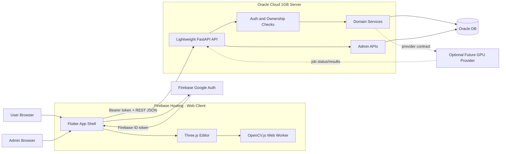
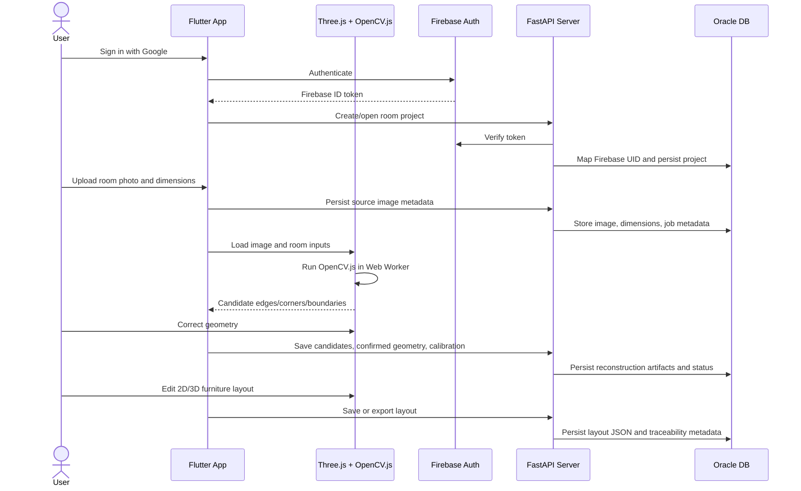

# RoomForge Architecture

RoomForge is a web-first room reconstruction and furniture planning app. The MVP keeps the application server lightweight: the browser/editor handles OpenCV-assisted candidate extraction, while the server verifies auth, persists data, exposes APIs, and supports admin troubleshooting.

## System Overview

## Core Flow

## Component Responsibilities

- `app/`: Flutter web shell for auth, navigation, forms, project workflows, admin screens, and accessible non-canvas controls.
- `editor/`: TypeScript Three.js package for source-image alignment, OpenCV overlays, geometry correction, 2D/3D rendering, and furniture manipulation.
- `server/`: Lightweight FastAPI service for Firebase token verification, authorization, REST APIs, Oracle DB access, job metadata, layout persistence, and admin operations.
- `Oracle DB`: System of record for users, projects, source images, room dimensions, reconstruction jobs, status transitions, CV artifacts, corrected geometry, layouts, failures, and retry history.
- `Firebase`: Hosting for the web client and Google Auth for identity.
- `Optional provider`: Post-MVP GPU/deep-learning workers can plug into the same reconstruction job/result contract without becoming required for MVP.

## Key Constraints

- The Oracle Cloud 1GB server must not run heavy OpenCV, deep-learning, or GPU inference workloads.
- MVP OpenCV processing runs in the browser/editor layer, preferably in a Web Worker.
- Oracle DB is the primary application data store.
- Every user-facing API request must verify Firebase identity and enforce Oracle-side ownership.
- Candidate geometry and user-confirmed geometry stay separate in storage and APIs.
- Persisted reconstruction status uses `review_required`; user-facing copy may display "Needs review."
