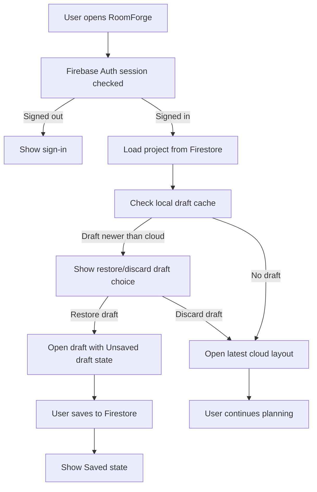
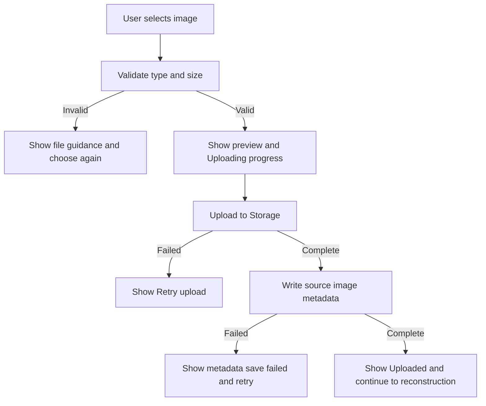
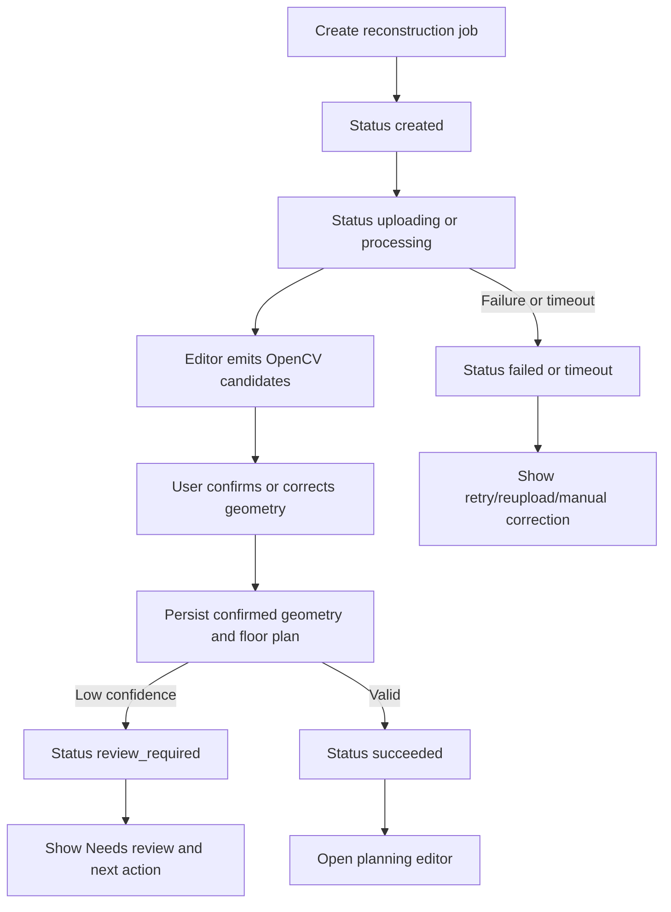
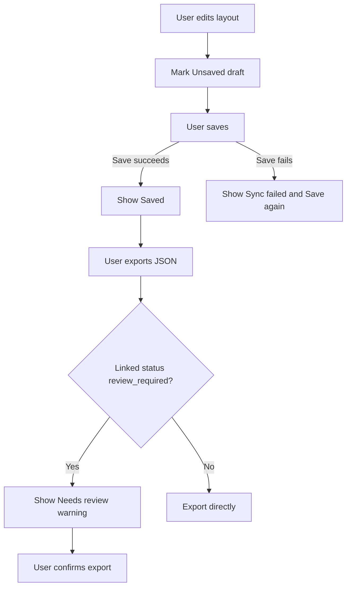
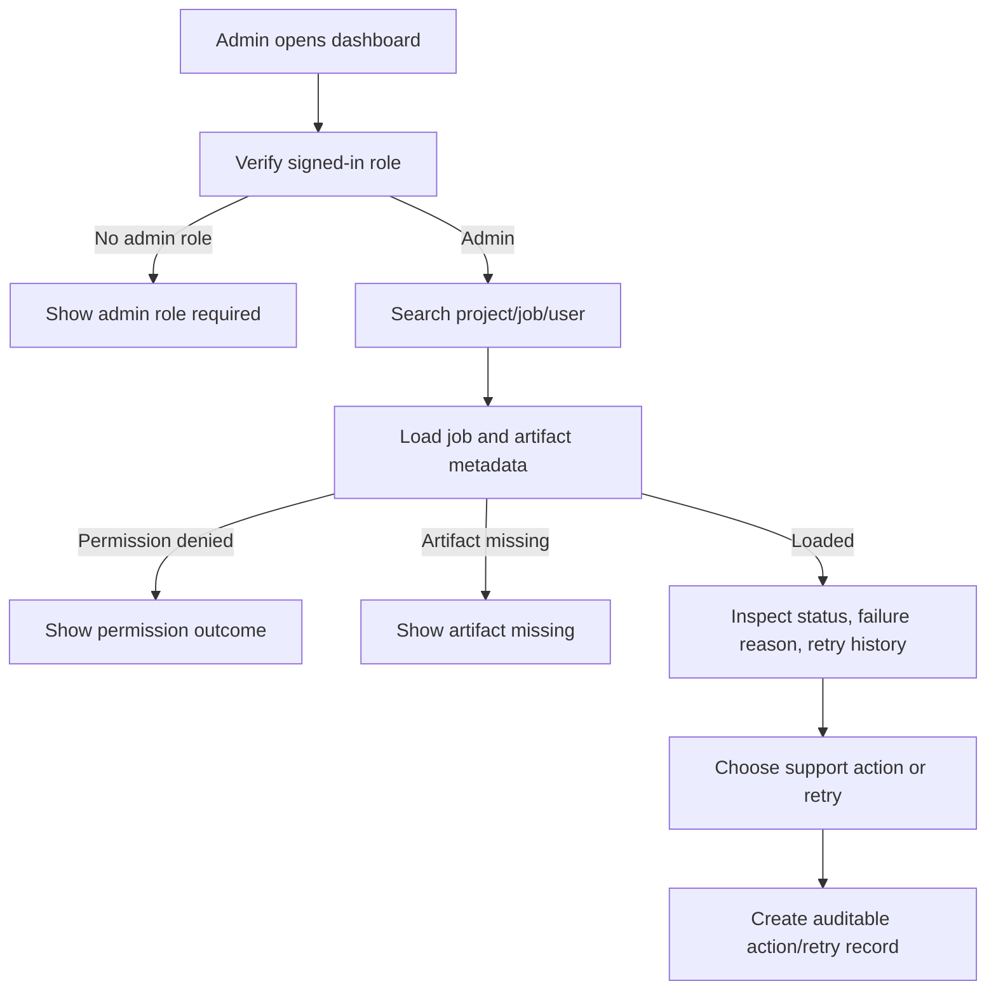

# UX Design Specification RoomForge Firebase Refactor

**Author:** Yoon
**Date:** 2026-05-24

---

<!-- UX design content will be appended sequentially through collaborative workflow steps. -->

## Executive Summary

### Project Vision

RoomForge is a web-first room reconstruction and furniture planning application that turns a room photo, user-entered dimensions, OpenCV-assisted geometry correction, and metric calibration into an editable 2D/3D planning workspace.

This Firebase refactor does not change the product promise. It changes how continuity, persistence, upload, authorization, admin visibility, and recovery are experienced. The UX must continue to feel like one guided planning product even though persistence moves from a legacy API/Oracle path to Firebase Auth, Firestore, Cloud Storage, Security Rules, and local draft/cache support.

The target experience should make Firebase-backed state feel dependable and visible: projects sync automatically, image uploads show progress, reconstruction states update without manual polling, saved layouts clearly distinguish saved cloud state from unsaved local draft state, and permission failures produce calm recovery guidance instead of technical backend errors.

### Target Users

Primary users remain everyday room planners who want a fast path from a real room photo and approximate dimensions to a useful, editable room plan. They are not expected to understand backend systems, Firestore, Storage, security rules, or synchronization mechanics.

Secondary users include technical/demo evaluators who need the OpenCV pipeline to remain inspectable through source images, candidates, corrected geometry, calibration output, floor plans, and saved layouts.

Admin and support users need Firebase-backed operational clarity: user/project lookup, job status inspection, artifact access where authorized, retry history, permission-aware troubleshooting, and safe intervention controls.

### Key Design Challenges

The first design challenge is preserving trust during the backend transition. Users should not experience the removal of the legacy API as lost reliability. Firebase-backed save, load, upload, and job state must feel explicit, recoverable, and understandable.

The second challenge is sync and draft clarity. Firestore is the system of record, while IndexedDB may preserve local draft/cache state. The UX must clearly distinguish saved cloud state, unsaved local edits, recoverable drafts, failed saves, and conflict/reload situations.

The third challenge is upload and artifact access. Cloud Storage introduces upload progress, file validation, permission-scoped reads, possible storage-rule denial, and missing-artifact states. These need user-facing and admin-facing recovery paths.

The fourth challenge is admin authorization. Admin role access now depends on Firebase-backed role state and security rules. Admin users need clear denied, stale-role, refresh, and insufficient-permission states without exposing other users' data.

### Design Opportunities

Firebase streams can make reconstruction and save/load continuity feel more immediate than polling. Job timelines, project lists, and admin dashboards can update live or near-live when practical.

Local draft/cache support can improve user confidence by preserving work across refresh, navigation, and short connectivity interruptions, as long as the UX does not confuse local drafts with saved cloud layouts.

Security-rule-aware UX can turn permission failures into clearer product states: signed out, access removed, admin role required, artifact unavailable, or project not found.

The refactor is an opportunity to standardize persistence feedback across the app: upload progress, saving, saved, offline draft, retry available, sync failed, permission denied, and export warning when reconstruction status is `review_required`.

## Core User Experience

### Defining Experience

The defining Firebase refactor experience is uninterrupted room planning continuity. Users should feel that projects, uploads, reconstruction state, drafts, saved layouts, and exports remain dependable as RoomForge moves from a legacy API-backed model to Firebase-backed persistence.

The core user action remains creating and refining a room layout, but the key UX behavior introduced by this refactor is clear persistence state: users should always understand whether work is uploading, processing, saved to cloud, preserved as a local draft, blocked by permission, or recoverable after failure.

For admin and support users, the defining experience is permission-aware troubleshooting. They should be able to inspect Firebase-backed job state, project context, artifact availability, retry history, and failure causes without guessing whether a problem is caused by auth, rules, missing storage objects, sync delay, or reconstruction logic.

### Platform Strategy

RoomForge remains desktop web-first for detailed 2D/3D editing, with tablet and mobile web supporting sign-in, project review, upload, status checking, and lightweight recovery.

Firebase-backed UX should treat Auth, Firestore, Storage, and local draft/cache state as invisible infrastructure, surfaced only through product language. Users should see clear states such as Signed in, Uploading, Processing, Saved, Unsaved draft, Sync failed, Permission required, and Needs review.

The editor remains a Three.js/OpenCV.js spatial workspace embedded in the Flutter shell. Flutter owns Firebase persistence and user-facing state. The editor should continue to feel like part of one product, but it should not expose Firebase implementation details.

Offline functionality is not a full MVP promise. However, short-lived connectivity interruption, refresh recovery, and unsaved draft preservation should be supported where practical through local draft/cache UX.

### Effortless Interactions

Sign-in should feel like a single entry point into saved projects and admin access where authorized.

Project list and project detail should refresh automatically or near-automatically when Firestore-backed data changes. Users should not need to manually poll or refresh to understand current reconstruction status.

Image upload should provide clear file validation, upload progress, completion, failure, and retry states. Upload failure should not feel like project failure.

Saving should be explicit but low-friction. The user should know whether the current layout is saved to Firestore, only preserved as a local draft, or waiting for retry after a failed sync.

Returning to a project should restore the most useful state: latest saved layout when available, recoverable local draft when appropriate, and a clear choice if saved cloud state and local draft state diverge.

Admin inspection should make permission and artifact states obvious: accessible, restricted, missing, failed to load, or role required.

### Critical Success Moments

The first success moment is sign-in continuity: a returning user sees their projects and understands that RoomForge remembers their work.

The second success moment is upload trust: the user sees the image upload progressing and completing, with source metadata preserved for reconstruction.

The third success moment is live reconstruction continuity: job state moves through created, uploading, processing, review_required, succeeded, failed, timeout, cancelled, or retrying without vague waiting.

The fourth success moment is save confidence: after editing furniture or geometry, the user can tell that the layout is saved to cloud or preserved as a local draft.

The fifth success moment is recovery clarity: permission denial, failed upload, missing artifact, sync failure, or `review_required` status gives a specific next action.

For admins, the critical success moment is diagnosing whether a failed or delayed job is caused by input quality, OpenCV output, geometry/calibration, Firestore data, Storage artifact access, authorization, or retry state.

### Experience Principles

1. Persistence must be visible but not technical: show product states, not Firebase concepts.

2. Saved cloud state and local draft state must never be ambiguous.

3. Upload, save, and reconstruction progress should always have a next action when blocked or failed.

4. Permission failures should protect data without making the user feel lost.

5. Firebase streams should improve continuity, not create surprising UI jumps.

6. Admin UX should separate user-facing recovery language from technical diagnostic detail.

## Desired Emotional Response

### Primary Emotional Goals

The Firebase refactor should make RoomForge feel more dependable, not more technical. Users should feel calm confidence that their project exists, their upload is progressing, their layout is saved, and their work can be recovered if something goes wrong.

The primary emotional goal is continuity. The user should feel that RoomForge remembers their work across sign-in, refresh, upload, reconstruction, editing, save, and return visits.

A secondary emotional goal is control. Users should feel they can understand and act on every persistence state: upload failed, sync failed, unsaved draft, saved to cloud, permission required, artifact missing, or needs review.

For admins, the emotional goal is operational clarity. Troubleshooting should feel deliberate and scoped, not like guessing through hidden backend behavior.

### Emotional Journey Mapping

On sign-in, users should feel recognized and oriented when their Firebase-backed project list appears.

During image upload, users should feel reassured by progress, validation, and retry affordances. A rejected file or failed upload should feel recoverable, not catastrophic.

During reconstruction, users should feel that the process is tracked. Firestore-backed state updates should replace vague waiting with visible continuity.

During editing, users should feel agency while also understanding save state. They should be able to keep working without wondering whether a layout is saved, unsaved, or only locally preserved.

After saving or exporting, users should feel relief and closure: the layout is safely stored or exported, and any `Needs review` caveat is visible before they rely on the result.

When returning later, users should feel continuity. If a local draft exists, the app should present it as a recoverable option, not as a confusing duplicate of the saved layout.

When permission or rules block access, users should feel protected and guided. The app should avoid raw technical language and explain whether they need to sign in, request access, refresh admin role, or choose another project.

Admin users should feel calm during lookup and diagnosis: job status, artifact availability, retry state, and permission boundaries should be readable at a glance.

### Micro-Emotions

Confidence over uncertainty is the most important micro-emotion for persistence. Users should see stable save, upload, and sync indicators.

Trust over suspicion matters when Firebase rules deny access or artifacts are missing. The user should understand that access is intentionally protected or the artifact is unavailable, not that RoomForge silently lost data.

Agency over helplessness matters during failures. Upload, save, sync, and reconstruction errors should always lead to a next action.

Calm over urgency matters in admin workflows. Admin views should surface enough technical detail to diagnose the issue without making retry or artifact access feel risky.

Clarity over surprise matters with realtime updates. Firestore streams should update views predictably and should not unexpectedly replace visible user edits without warning.

### Design Implications

To create continuity, use persistent project state, explicit save indicators, resumable recovery entry points, and clear return-to-project behavior.

To create control, label each state with user-facing language: Uploading, Uploaded, Processing, Saved, Unsaved draft, Sync failed, Retry available, Permission required, Needs review.

To create trust, distinguish cloud-saved state from local draft state and distinguish permission denial from missing data.

To create calm recovery, pair every failed state with a next action: retry upload, save again, restore draft, discard draft, refresh role, sign in again, or contact support/admin.

To avoid surprise, realtime updates should not overwrite active edits silently. If remote saved state changes while a local draft exists, the UX should ask users to choose which state to continue from.

### Emotional Design Principles

1. Continuity is the emotional contract of the Firebase refactor.

2. Every persistence state should reduce uncertainty.

3. Recovery language should be calm, specific, and action-oriented.

4. Permission boundaries should feel protective, not broken.

5. Realtime updates should feel helpful, not intrusive.

6. Admin troubleshooting should feel auditable and scoped.

## UX Pattern Analysis & Inspiration

### Inspiring Products Analysis

Floorplanner remains the primary inspiration for RoomForge's spatial planning experience. Its most relevant lesson is that 2D precision and 3D inspection should feel like synchronized views of the same room, not separate tools.

Toss remains the interaction-quality inspiration. Its relevant lesson is fast, calm, stateful feedback: transitions, confirmations, and error recovery should feel clear without slowing users down.

Google Docs and Drive are useful references for Firebase-backed persistence. Their strongest transferable pattern is visible cloud save state: saved, saving, offline, sync issue, and recoverable conflict states are expressed without exposing storage implementation.

Notion is a useful reference for local continuity and return-to-work behavior. It makes returning to recent work, preserving unsaved edits, and recovering from connectivity issues feel normal rather than exceptional.

Firebase Console is a useful admin reference, but only for admin surfaces. It shows how dense status tables, scoped permissions, logs, and resource metadata can support diagnosis without leaking into the everyday user experience.

### Transferable UX Patterns

RoomForge should adopt synchronized 2D/3D spatial state from Floorplanner: selected object, camera/view mode, dimensions, and unsaved edits must persist across view switches.

RoomForge should adapt Toss-like state feedback for upload, save, retry, permission, and recovery transitions. Motion and messages should clarify state changes, not hide delay or failure.

RoomForge should adopt cloud-save visibility from Google Docs/Drive: `Saved`, `Saving`, `Unsaved draft`, `Sync failed`, and `Retry available` should be consistent across editor, project, and export flows.

RoomForge should adapt Notion-like return continuity: reopening a project should clearly offer the latest cloud layout or a recoverable local draft when one exists.

Admin screens should adapt Firebase Console-like diagnostic density: status, owner, project, job, artifact, role, retry history, and rule/permission outcome should be scannable.

### Anti-Patterns to Avoid

Do not expose Firebase implementation language to everyday users. Users should not see Firestore, Storage rules, document IDs, or collection paths unless they are in an admin/debug context.

Do not silently overwrite active editor work when Firestore streams receive remote changes.

Do not let local drafts look identical to cloud-saved layouts. Ambiguity here will damage trust.

Do not treat permission denial as a generic error. The UX should distinguish signed out, no access, admin role required, artifact restricted, and missing data.

Do not make admin troubleshooting visually similar to the user planning experience. Admin views need density and technical metadata; user views need guidance and calm recovery.

### Design Inspiration Strategy

Adopt Floorplanner's synchronized planning model for the editor.

Adopt Toss-like feedback quality for transitions, confirmation, permission, and recovery states.

Adapt Google Docs/Drive save-state patterns for Firebase-backed persistence.

Adapt Notion's return-to-work and recoverable draft behavior for IndexedDB-backed local draft/cache UX.

Adapt Firebase Console only for admin diagnostic surfaces, not for user-facing flows.

## Design System Foundation

### 1.1 Design System Choice

RoomForge should continue using a hybrid design system foundation:

- Flutter Material 3 for app shell, forms, navigation, status surfaces, dialogs, admin tables, and accessibility-heavy controls.
- Custom RoomForge spatial/editor tokens for Three.js canvas states, OpenCV overlays, geometry handles, measurement guides, furniture selection, and 2D/3D editor feedback.
- Firebase-specific persistence state tokens layered on top of the existing RoomForge UX language.

This is an established-system-plus-custom-spatial-layer approach. It keeps implementation fast and accessible while preserving the specialized visual language needed for reconstruction, geometry review, and cloud/draft state clarity.

### Rationale for Selection

Material 3 remains the right foundation because RoomForge is a Flutter app and needs dependable web-first UI patterns for sign-in, project management, upload, forms, admin workflows, dialogs, sheets, tables, and accessible controls.

A fully custom design system would slow the Firebase refactor and create unnecessary risk. The product needs more consistency and clarity, not a brand-new visual direction.

A pure Material-only approach is insufficient because RoomForge has domain-specific states that standard components do not cover: OpenCV candidate geometry, confirmed geometry, selected handles, metric calibration, cloud save state, local draft state, permission boundaries, and admin artifact diagnostics.

The selected approach supports both user-facing calm guidance and admin-facing diagnostic density.

### Implementation Approach

Use Material 3 components for:

- Google sign-in and auth state.
- Project list/detail screens.
- Upload surfaces and progress indicators.
- Forms for room dimensions, calibration values, and furniture metadata.
- Save/export controls.
- Recovery banners and dialogs.
- Admin tables, filters, timelines, and permission messages.

Use custom RoomForge tokens/components for:

- Candidate geometry overlays.
- Confirmed geometry overlays.
- Selection handles and geometry edit states.
- 2D/3D editor mode controls.
- Measurement and scale guides.
- Furniture object state and placement warnings.
- Cloud save, local draft, sync failed, permission required, artifact missing, and needs review states.

Use the Flutter layer for accessible state controls and summaries. Use the Three.js layer for spatial rendering and direct manipulation, but mirror critical state through Flutter controls where possible.

### Customization Strategy

Add Firebase persistence states to the existing RoomForge status language:

- `Saving`
- `Saved`
- `Unsaved draft`
- `Sync failed`
- `Retry available`
- `Permission required`
- `Artifact missing`
- `Needs review`

These states should use consistent badge, banner, inline message, and admin table treatments.

Do not create a separate Firebase-branded visual layer. Firebase should remain infrastructure, while RoomForge product language owns the user experience.

For user-facing screens, keep status text calm and action-oriented. For admin screens, include technical metadata such as user/project/job IDs, role state, artifact path availability, retry linkage, and permission outcome where useful.

## 2. Core User Experience

### 2.1 Defining Experience

The defining Firebase refactor interaction is "resume and trust my room plan." A user should be able to open RoomForge, return to a project, see the latest saved layout or recoverable local draft, understand current upload/reconstruction/save state, and continue planning without thinking about backend infrastructure.

The product's original defining experience remains turning a room photo and dimensions into an editable metric planning workspace. The Firebase refactor strengthens the continuity layer around that experience: upload state, reconstruction state, cloud save state, local draft recovery, permission boundaries, and admin diagnosis.

If this interaction is right, users will describe RoomForge as an app that remembers their room project and keeps their work safe while they experiment with layout decisions.

### 2.2 User Mental Model

Users think in terms of rooms, photos, outlines, furniture, and saved plans. They do not think in terms of Firestore documents, Storage paths, security rules, or local IndexedDB drafts.

For saved work, users bring a cloud-document mental model: if they signed in and saved, the project should be available later. If something is unsaved, the app should say so. If a draft exists, it should be presented as recoverable work rather than a second mysterious version.

For uploads, users expect progress, validation, and retry. A failed upload should mean "try again" rather than "the project is broken."

For admin users, the mental model is diagnostic: find the user/project/job, see what state it is in, inspect what artifacts are available, and choose a safe next action.

### 2.3 Success Criteria

The core experience succeeds when users can return to a project and immediately answer:

- What is saved in the cloud?
- Is there an unsaved local draft?
- Is upload, reconstruction, or save still in progress?
- Did something fail, and what can I do next?
- Is the layout safe to export, or does it need review?

Users should feel successful when they resume editing without losing context, save with visible confirmation, recover from upload/save failures, and understand `Needs review` before export.

Admin success means a support/admin user can distinguish input quality, OpenCV/correction, Firestore data, Storage artifact, permission, and retry-state issues without relying on hidden implementation knowledge.

### 2.4 Novel UX Patterns

Most Firebase refactor patterns should be familiar: cloud save indicators, upload progress, retry banners, permission messages, and recoverable drafts.

The novel part is combining these persistence patterns with a spatial reconstruction editor. RoomForge must show save/draft/sync state without covering critical geometry or making the 2D/3D editor feel like a document editor.

A second novel pattern is permission-aware admin artifact diagnosis. Admins need technical visibility into artifacts and security outcomes, while regular users need simpler recovery language.

The design should teach the pattern through consistent labels and placement rather than onboarding text. Users should repeatedly see the same save/draft/retry/permission states in project, editor, and export contexts.

### 2.5 Experience Mechanics

**Initiation:** The user signs in, opens a project, uploads a source image, or returns to an existing room layout.

**Interaction:** The app loads Firestore-backed project state, checks for a local draft, shows current upload/reconstruction/save state, and lets the user continue editing or choose between saved cloud layout and recoverable draft when needed.

**Feedback:** The UI shows stable state indicators such as Saved, Saving, Unsaved draft, Sync failed, Uploading, Retry available, Permission required, Artifact missing, and Needs review.

**Mistake Handling:** Failed upload, failed save, permission denial, missing artifact, and cloud/draft conflict all produce specific recovery actions. The app should not collapse these into a generic error.

**Completion:** The user sees a saved cloud state, exports a layout with any review warning surfaced, or intentionally restores/discards a local draft. Admin users complete the flow by identifying the likely failure source and recording or triggering a safe retry/action.

## Visual Design Foundation

### Color System

The existing RoomForge visual direction should remain intact. The Firebase refactor adds semantic persistence and permission state colors rather than a new Firebase-branded palette.

The color system should distinguish:

- Neutral/in-progress states: `Saving`, `Uploading`, `Processing`.
- Positive states: `Saved`, `Uploaded`, `Synced`.
- Recoverable warning states: `Unsaved draft`, `Needs review`, `Retry available`.
- Error states: `Sync failed`, `Upload failed`, `Artifact missing`.
- Permission states: `Permission required`, `Admin role required`, `Access removed`.

These states must be represented by more than color. Use badges, icons, labels, stroke styles, placement, and concise text so color is never the only signal.

### Typography System

Typography should follow the existing RoomForge/Material 3 hierarchy. Firebase refactor additions are primarily status labels, banners, table cells, and short recovery guidance.

Status labels should be short and scannable. Recovery copy should be plain, specific, and action-oriented:

- "Save again"
- "Restore draft"
- "Discard draft"
- "Retry upload"
- "Refresh admin role"
- "Sign in again"

Admin metadata can be denser, but it should still use clear labels for user ID, project ID, job ID, role, artifact availability, retry linkage, and permission outcome.

### Spacing & Layout Foundation

Firebase persistence states should fit into existing layouts without crowding the spatial editor. Desktop editor layouts should reserve stable locations for save/draft/sync indicators so state changes do not shift primary tools.

Recommended placement:

- Project list/detail: status badges near project title and latest activity.
- Upload flow: progress and validation near the file preview.
- Editor: compact save/draft/sync status near save/export controls.
- Recovery: banners above the affected area, not as disruptive modal defaults.
- Admin: dense table columns and detail panels for diagnostic metadata.

### Accessibility Considerations

All Firebase persistence and permission states must be readable by assistive technology in the Flutter layer where possible. The Three.js editor should not be the only place where save, draft, permission, or reconstruction state is communicated.

Minimum accessibility expectations:

- Status changes use text, not color alone.
- Important save/sync/upload state changes are announced or reachable by screen reader where feasible.
- Buttons expose clear labels such as "Retry upload" or "Restore local draft."
- Permission-denied states do not leak protected project details.
- Admin tables maintain keyboard focus, readable badges, and clear row/detail relationships.

## Design Direction Decision

### Design Directions Explored

The existing RoomForge visual direction remains the baseline. This refactor does not require a new full visual direction or a replacement `ux-design-directions.html`.

The design exploration is limited to a Firebase persistence overlay layer:

- Cloud save visibility in project and editor surfaces.
- Local draft recovery choices.
- Upload progress and Storage artifact states.
- Permission-aware user and admin recovery.
- Admin diagnostic density for Firestore/Storage-backed records.

### Chosen Direction

The chosen direction is "Quiet Continuity Layer." It keeps the existing RoomForge planning/editor UI and adds a restrained, consistent state system for saved cloud data, local drafts, sync failures, permissions, artifacts, and retries.

The direction should feel more like a dependable document workspace than a backend dashboard for normal users. Admin views can be denser and more diagnostic.

### Design Rationale

This direction supports the emotional goal of continuity without turning Firebase into visible product branding. It avoids overhauling the room-planning experience while making the backend refactor visible where users need trust: upload, save, return, recovery, and admin diagnosis.

### Implementation Approach

Do not generate a new Firebase-specific design-directions HTML file unless a future visual redesign is requested. Continue using the existing product visual direction, then add:

- Persistence badges.
- Save/draft banners.
- Upload progress states.
- Permission recovery states.
- Admin diagnostic table/detail patterns.

## User Journey Flows

### Returning To A Project With Cloud State And Local Draft

This flow protects the user's sense of continuity when Firestore saved state and IndexedDB local draft state both exist.

### Source Image Upload And Metadata Persistence

This flow makes Cloud Storage upload progress and Firestore metadata persistence understandable without exposing implementation details.

### Reconstruction State Continuity

This flow replaces vague waiting with visible Firestore-backed job state.

### Layout Save, Export, And Review Warning

This flow distinguishes saved cloud state, local draft state, and review warnings.

### Admin Permission-Aware Troubleshooting

Admin flow must separate access issues from missing data and reconstruction failures.

### Journey Patterns

- Every persistence journey needs a visible current state, last known saved state, and next action.
- Recovery choices should be local to the affected object: image upload, layout draft, reconstruction job, artifact, or permission.
- Admin flows can expose IDs and technical metadata; user flows should use plain recovery language.
- Realtime updates should refresh passive status surfaces but should not overwrite active edits without user choice.

### Flow Optimization Principles

- Minimize the number of states users must understand at once.
- Keep save/draft/sync indicators stable in placement.
- Prefer inline recovery for ordinary failures and dialogs only for destructive choices.
- Preserve room-planning context through upload, reconstruction, save, and return flows.

## Component Strategy

### Design System Components

Use Material 3 components for the standard app shell:

- Buttons, icon buttons, segmented controls, tabs, menus, dialogs, sheets, snackbars, progress indicators, forms, inputs, tables, list items, cards for repeated records, and navigation rails/drawers where appropriate.

Use existing editor components for spatial manipulation:

- Canvas layers, geometry handles, overlay labels, camera controls, selection outlines, grid/measurement guides, and 2D/3D mode controls.

### Custom Components

#### Persistence Status Badge

**Purpose:** Show cloud/draft/sync state in project, editor, and export contexts.
**Usage:** Use near project titles, save/export controls, and admin rows.
**States:** Saving, Saved, Unsaved draft, Sync failed, Retry available.
**Accessibility:** Text label must be present; color cannot be the only signal.

#### Draft Recovery Banner

**Purpose:** Let users restore or discard local draft state.
**Usage:** Show when a local draft exists and differs from Firestore saved state.
**Actions:** Restore draft, discard draft, view saved version.
**States:** Draft available, draft newer than cloud, draft restore failed.
**Accessibility:** Actions must be keyboard reachable and clearly labeled.

#### Upload Progress Panel

**Purpose:** Show Cloud Storage upload progress and Firestore metadata persistence.
**Usage:** Use in source image upload flow.
**States:** Validating, uploading, uploaded, metadata saving, upload failed, metadata save failed.
**Actions:** Retry upload, choose another file, continue.

#### Permission Recovery Notice

**Purpose:** Explain access boundaries without exposing protected data.
**Usage:** Use when signed out, role missing, project access removed, artifact restricted, or admin role required.
**Actions:** Sign in, switch account, refresh role, return to projects, contact admin.

#### Artifact Availability Cell

**Purpose:** Give admins a compact artifact status in tables.
**Usage:** Use in admin job/project/artifact tables.
**States:** Available, restricted, missing, failed to load, not generated.
**Content:** Include technical metadata only in admin context.

#### Cloud Draft Conflict Resolver

**Purpose:** Resolve conflicts between saved cloud layout and local draft.
**Usage:** Use on project open or save conflict.
**Actions:** Continue with cloud version, restore local draft, compare summary, discard draft.

### Component Implementation Strategy

Build Firebase UX components in Flutter so they remain accessible and testable. The editor can receive state through bridge payloads when visual overlays need to reflect persistence or review status, but Flutter owns final state presentation and actions.

Custom components should use the same state vocabulary across user and admin surfaces. Admin variants can show IDs and technical metadata; user variants should stay concise and recovery-focused.

### Implementation Roadmap

**Phase 1 - Required for Firebase baseline**

- Persistence Status Badge.
- Upload Progress Panel.
- Permission Recovery Notice.
- Basic admin artifact/status table states.

**Phase 2 - Required for editor continuity**

- Draft Recovery Banner.
- Cloud Draft Conflict Resolver.
- Editor save/draft status placement.

**Phase 3 - Refinement**

- Detailed admin artifact viewer state variants.
- Cross-project draft recovery summaries.
- More granular sync/retry diagnostics.

## UX Consistency Patterns

### Button Hierarchy

Primary actions should advance the user toward safe continuity: Save, Restore draft, Retry upload, Continue editing, Export, Refresh role.

Secondary actions should support alternatives: Discard draft, Choose another file, View saved version, Return to projects, Show details.

Destructive or irreversible actions such as discarding a local draft or deleting a project require explicit confirmation and must not be the default focused action.

### Feedback Patterns

Use consistent labels:

- `Saving`
- `Saved`
- `Unsaved draft`
- `Sync failed`
- `Retry available`
- `Uploading`
- `Uploaded`
- `Permission required`
- `Artifact missing`
- `Needs review`

Each failed state must include a next action. Avoid generic "Something went wrong" unless paired with details and recovery.

### Form Patterns

Room dimensions, calibration inputs, furniture values, and admin filters should keep existing inline validation patterns.

Firebase-specific validation should appear near the affected action:

- File type/size near upload.
- Save failure near save controls.
- Permission failure near the protected content area.
- Admin role failure at admin entry.

### Navigation Patterns

Project navigation should preserve cloud/draft context. Returning to a project should not silently skip a recoverable draft.

Admin navigation should preserve filters and selected job context when moving between dashboard, job detail, artifact detail, and retry/action records.

### Modal and Overlay Patterns

Use dialogs for destructive draft discard, irreversible delete, or retry actions that create new records. Use inline banners or side panels for ordinary upload, save, sync, and permission recovery.

Editor overlays should not hide critical geometry. Persistence state belongs in stable shell controls or compact editor chrome, not in the center of the canvas.

### Empty, Loading, And Recovery States

Empty project states should offer a create/start action. Empty admin states should explain the filter or search needed.

Loading states should identify the resource: loading project, loading saved layout, checking local draft, uploading image, saving metadata, saving layout, loading artifact.

Recovery states must be specific: retry upload, save again, restore draft, discard draft, refresh role, sign in again, choose another project.

### Search And Filtering Patterns

User search should remain simple: project name, recent activity, saved status.

Admin search can include user ID, project ID, job ID, status, artifact availability, retry state, and permission outcome.

### Admin Patterns

Admin surfaces should prioritize scannability:

- Status badge.
- Owner/project/job reference.
- Artifact availability.
- Failure reason.
- Retry count.
- Last updated timestamp.
- Permission outcome.

Admin actions should be auditable and linked to the related job/project.

## Responsive Design & Accessibility

### Responsive Strategy

Desktop remains the primary target for detailed editor and admin work. Use desktop space for stable canvas, side inspectors, save/draft status, upload metadata, and admin diagnostic tables.

Tablet should support project review, upload, status checking, light geometry review, and simple save/export operations with collapsed panels.

Mobile should support sign-in, project list/detail, upload/reupload, status review, and recovery decisions. Full precision furniture editing remains desktop-first.

### Breakpoint Strategy

Use the existing RoomForge breakpoint strategy:

- Mobile: 320-767px.
- Tablet: 768-1023px.
- Desktop: 1024-1439px.
- Wide desktop: 1440px and above.

Persistence status indicators must remain visible at all breakpoints. On small screens, collapse secondary metadata behind details controls but keep the primary state and next action visible.

### Accessibility Strategy

Target WCAG 2.2 AA for Flutter app shell, upload flows, save/export controls, project screens, admin tables, dialogs, banners, and recovery states.

Firebase refactor accessibility requirements:

- Save/draft/sync/upload/permission states must be text-readable.
- State changes should be announced where feasible.
- Keyboard users must be able to restore/discard drafts, retry upload, save again, refresh role, and navigate admin tables.
- Permission messages must not leak protected names or artifacts.
- Canvas-only indicators must have Flutter-side summaries where practical.

### Testing Strategy

Responsive testing should cover:

- Desktop editor with save/draft status visible.
- Tablet upload and project recovery.
- Mobile project return and retry flows.
- Admin desktop table density and filter persistence.

Accessibility testing should cover:

- Keyboard-only save/draft/retry flows.
- Screen reader labels for persistence badges and recovery banners.
- Contrast and non-color-only status distinctions.
- Reduced-motion behavior for status transitions.
- Permission-denied states that avoid protected-data leakage.

### Implementation Guidelines

Keep persistence and permission state controls in accessible Flutter UI. Mirror only necessary spatial indicators into Three.js.

Use stable layout regions for save/draft/sync state to avoid layout shifts during realtime updates.

Do not make Firestore stream updates overwrite active edits. If remote state changes while a local draft exists, show a conflict/recovery choice.

Prefer inline recovery over modal interruption unless the action is destructive or creates a new retry/action record.

## Workflow Completion

### Completion Status

This Firebase UX design workflow is complete for the refactor planning layer.

The document is ready to guide:

- Firebase data contract UX requirements.
- Refactor epic/story creation.
- Flutter component implementation.
- Editor bridge state updates.
- Admin troubleshooting UX.

### Supporting Visual Assets

No new Firebase-specific HTML visualizer was generated for this UX delta. The existing product visual direction remains valid:

- `docs/product/ux-design-directions.html`

The Firebase refactor adds persistence, draft, permission, and admin diagnostic state patterns on top of that visual direction.

### Recommended Next Steps

1. Create `docs/refactor/firebase-data-contract.md`.
2. Create `docs/refactor/firebase-refactor-workplan.md`.
3. Create `docs/refactor/firebase-validation-plan.md`.
4. Generate Firebase refactor epics/stories from the architecture and UX delta.
5. Update `docs/product/ux-design-specification.md` only where product-level UX behavior must change.
